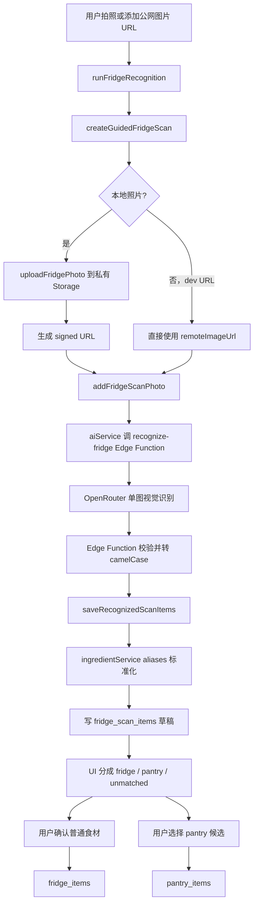
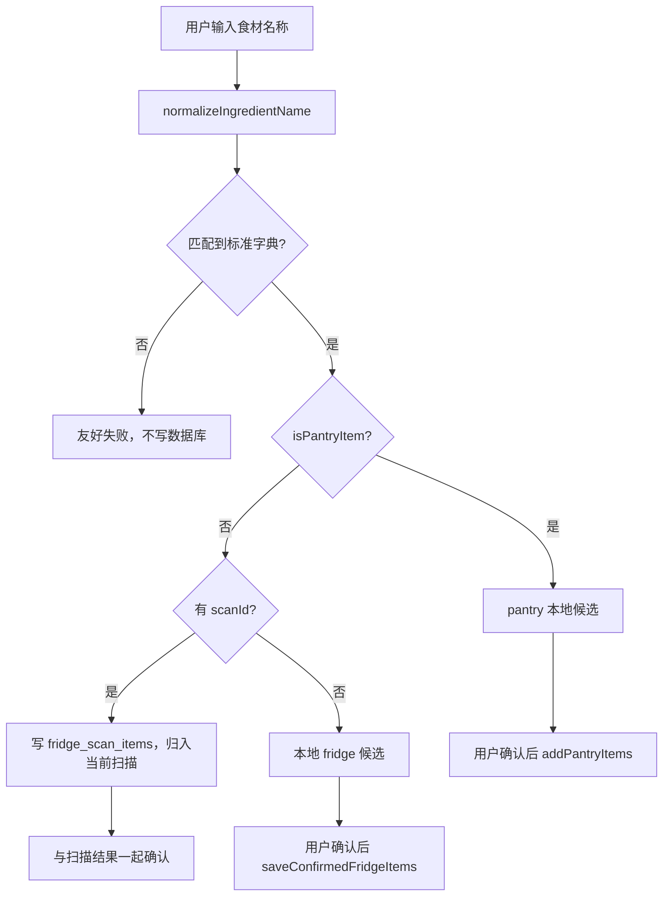

# 冰箱侦探：Fridge Recognition、真实前端、Content v0.2、Profile 与 Pantry 分流阶段总结

> 文档日期：2026-06-18  
> 适用项目：Fridge Detective / 冰箱侦探  
> 当前仓库：`F:\AI_PROJECTS\whats_for_dinner___total_file\project\fridge-detective`  
> 当前分支：`feature/user-profile-function`  
> 当前 HEAD：`31bf70d`（`6.18.1.42改pantry和fridgeitems分流逻辑。对齐ingredients库`）  
> 当前工作树：干净  
> 文档用途：把 2026-06-10 之后缺失的项目上下文、阶段成果、关键决策、真实链路、已知边界和下一步完整同步给新的 GPT / AI 会话。

---

## 0. 给新会话的最短结论

冰箱侦探已经从“Fridge 数据库地基 + mock service 测试页”推进到一版真正能够连接 Supabase 后端和 OpenRouter 视觉模型的产品原型：

```txt
相机拍照 / 公网图片 URL
→ 创建 fridge scan
→ 本地照片上传私有 Supabase Storage（URL 模式可绕过上传用于 dev）
→ 为照片创建 fridge_scan_photos 记录
→ 调用 Supabase Edge Function recognize-fridge
→ Edge Function 使用 OpenRouter 视觉模型识别单张图片
→ 返回结构化 JSON
→ ingredientService 根据 ingredient_key / 中英文名 / aliases 标准化
→ AI 结果先进入 fridge_scan_items 草稿
→ 页面只把匹配到标准字典的项目交给用户选择
→ 普通食材确认后写 fridge_items
→ pantry / 调料候选确认后写 pantry_items
```

同时，User Profile 页面也从旧工程检查页升级成了有产品感、能真实读写 Supabase 的 Onboarding / Profile 原型，能保存用户饮食规则、菜系偏好、做饭时间、熟练度、厨具、常备 pantry 和不想吃的食材。

当前已经解决两个会影响长期架构的问题：

1. **AI 识别出的任意文本不能直接成为正式库存。** 未匹配字典的内容只留在 `fridge_scan_items` 供 debug，不进入主选择区，也不能进入 `fridge_items`。
2. **`ingredients` 是统一标准词典，不代表存储位置。** 标准化后根据 `isPantryItem` 分流：普通食材进入 `fridge_items`，常备调料/干货进入 `pantry_items`。

仍未完成的产品闭环主要是：正式首页/路由、推荐算法与 Top 8、确认后自动刷新推荐、iOS 真机相机与上传测试、识别状态机收尾、正式 UI 拆组件和自动化测试。

---

## 1. 本阶段开始前已有的地基

虽然本文件重点记录真实识别 API 和前端开始之后的工作，但这些能力建立在 2026-06-10 前后完成的 Fridge Foundation v0.1 上，不能割裂理解。

### 1.1 Recipe / Ingredient Foundation 已提供统一词典

Fridge 模块没有另建食材表，而是复用：

- `public.ingredients`
- `services/ingredientService.ts`
- `types/recipe.ts`

统一词典包含：

- 稳定的 `ingredient_key`
- `zh_name`
- `en_name`
- `aliases: text[]`
- `is_fresh`
- `is_pantry_item`
- `is_active`
- 默认单位等元数据

`ingredientService` 已提供：

- `getIngredientDictionary()`
- `normalizeIngredientName(rawName)`
- `normalizeRecognizedIngredients(items)`

匹配会考虑：

```txt
ingredient_key
→ 中文名
→ 英文名
→ 英文名的 key-like 形式
→ aliases
```

输入会做 trim、英文小写、连续空格归一化，以及空格/连字符到下划线的 key-like 归一化。

### 1.2 Fridge Foundation v0.1 已建立四张私有表

`004_fridge_foundation.sql` 建立：

- `fridge_scans`：一次扫描任务。
- `fridge_scan_photos`：一次扫描中的照片及识别状态。
- `fridge_scan_items`：AI 或手动识别草稿、用户确认前的候选区。
- `fridge_items`：用户确认后的正式冰箱库存。

长期成立的边界：

- AI 结果不能直接进 `fridge_items`。
- `confidence` 只存在于 `fridge_scan_items`，不进入正式库存。
- `fridge_items` 对同一用户、非空 `ingredient_key`、`status = 'active'` 使用 partial unique index，避免同一标准食材出现多个 active 行。
- 私有表全部启用 RLS，仅授权 `authenticated`，通过 `auth.uid() = user_id` 限制读写。
- 页面不直接 `supabase.from(...)`，统一经过 services。

### 1.3 `fridgeService.ts` 已完成 DB service 闭环

公开方法为：

- `createGuidedFridgeScan()`
- `addFridgeScanPhoto()`
- `saveRecognizedScanItems()`
- `addManualScanItem()`
- `getScanItems()`
- `confirmFridgeScanItems()`
- `saveConfirmedFridgeItems()`
- `getCurrentFridgeItems()`
- `removeFridgeItem()`

它负责数据库读写、user ownership、quantity 合法化、snake_case/camelCase mapper 和 service error 包装，不负责 UI、相机、Storage 或 AI。

---

## 2. 产品北极星与前端融合原则

本阶段的北极星已经明确为：

> 饿了就拍一下，冰箱更新，推荐立刻变准。

用户提供了同学制作的 Sahara Kitchen 纯前端页面、截图、线上网站和 `App.tsx` / `index.css` 作为重要视觉参考。该参考版本的优势是页面结构、品牌感、卡片、扫描仪和交互呈现较完整，但数据主要写死在前端。

因此形成了以下融合原则：

1. 好看的壳尽量保留，包括暖米白背景、陶土橙强调色、深棕文字、品牌顶栏、扫描器视觉、结果卡片、底部导航形态。
2. 写死的数据逐步替换成 service 返回的真实数据。
3. 已跑通的 Supabase / Storage / Edge Function / Fridge service 链路不能为了视觉重做而倒退。
4. 页面层只管理体验状态和展示，不直接访问数据库表。
5. debug 信息可以保留，但必须折叠在页面底部，不能成为主体验。
6. 当前页面仍是 dev prototype，但体验目标按照正式产品来设计，不再做 JSON debugger 风格。

因为同学版本是 Web React/Vite 风格，而当前项目是 Expo Router + React Native，最终没有直接照搬 DOM/CSS，而是用 React Native 组件和 `StyleSheet` 重新表达视觉结构。

---

## 3. 2026-06-12：真实识别 API 与产品原型第一版

对应提交：`f6b9fdd feat: add fridge recognition prototype flow`

### 3.1 新增前端到 Edge Function 的 AI service

新增 `services/aiService.ts`：

- 只导入 `lib/supabase`。
- 只调用：

```ts
supabase.functions.invoke('recognize-fridge', { body: input })
```

- 不直接请求 OpenRouter。
- 不访问任何 Supabase 表。
- 不写 `fridge_scan_items` / `fridge_items`。
- 不包含 OpenRouter key。
- 错误包装保留 `message / code / details / hint`。

这一步把 secret 和模型供应商细节从 App 前端隔离开。

### 3.2 新增识别请求/响应类型

新增 `types/fridgeRecognition.ts`，定义：

- `FridgeRecognitionPhotoQuality`
- `FridgeRecognitionSuggestedAction`
- `FridgeRecognitionQuantityKind`
- `FridgeRecognitionInput`
- `FridgeRecognitionPhotoAssessment`
- `FridgeRecognitionItem`
- `FridgeRecognitionResult`

前端使用 camelCase，例如：

- `photoAssessment`
- `needsRetake`
- `suggestedAction`
- `rawName`
- `displayName`
- `quantityKind`
- `quantityText`
- `quantityCount`
- `needsReview`
- `uncertaintyReason`

### 3.3 新增 OpenRouter Supabase Edge Function

新增 `supabase/functions/recognize-fridge/index.ts`。

职责：

- CORS 与 OPTIONS preflight。
- 只接受 POST。
- 校验 `zoneKey`。
- 要求至少存在 `imageUrl` 或 `imageDataUrl`。
- 从 Supabase Edge Function secrets 读取：
  - `OPENROUTER_API_KEY`
  - `OPENROUTER_MODEL`
- 请求 `https://openrouter.ai/api/v1/chat/completions`。
- messages 先放文字 prompt，再放图片。
- 优先使用严格 `json_schema` response format。
- 若模型/供应商不兼容 JSON Schema 且返回明确 400 schema 错误，降级重试 `json_object`。
- 解析 OpenRouter envelope，再解析模型 JSON 内容。
- 兼容模型偶尔返回 Markdown code fence 的情况。
- 把模型 snake_case 输出转换成 App camelCase。
- 不访问数据库，不写任何 Fridge 表。

Edge Function 还做了运行时兜底：

- 非法 quantity 降级为 `unknown`。
- `unknown` 清空 `quantityText` / `quantityCount`。
- `text` 清空 `quantityCount`。
- `count` 清空 `quantityText`。
- `confidence` clamp 到 `0..1`。
- confidence 低于 `0.7` 时自动 `needsReview = true`。
- 缺失或非法照片质量时按 `poor / retake_same_zone` 处理。

### 3.4 Prompt 文档与模型边界

新增 `docs/ai-prompt-fridge-recognition.md`，明确：

- 每次只识别一张照片。
- 系统已知道 `scanId / photoId / zoneKey / guidePrompt`，模型不输出这些字段。
- 只识别清楚可见的食材。
- 不猜不透明包装、盒子和遮挡容器内容。
- 不判断过期、安全、健康。
- 不推荐菜谱。
- 不输出 bbox / coordinates / regions。
- 不输出解释或 Markdown，只输出 JSON。
- 返回 `photo_assessment` 和 `items`。
- 识别结果只是草稿，后续必须经过用户确认。

`displayName` 暂时保留。它不是标准食材身份，标准身份仍是 `ingredientKey`；它可作为 AI 友好展示名和未匹配时的 fallback，但页面主显示优先使用字典中文名。

### 3.5 Secret 管理

`.env.example` 只加入非敏感说明：

- 前端仅使用 Supabase URL 和 anon key。
- OpenRouter key 只能配置到 Edge Function secrets。
- 没有建立 `EXPO_PUBLIC_OPENROUTER_API_KEY`。
- 没有把真实 token、service role key 或数据库密码提交到仓库。

---

## 4. Storage、相机与一次完整识别编排

### 4.1 私有 Storage bucket

新增 `005_fridge_photos_storage.sql`：

- 建立私有 bucket：`fridge-photos`。
- bucket `public = false`。
- `storage.objects` 的 SELECT / INSERT / UPDATE / DELETE policy 只允许 authenticated 用户操作自己 userId 前缀下的路径。
- 路径约定：

```txt
{userId}/{scanId}/{timestamp-random}.{jpg|png|webp}
```

### 4.2 图片上传 service

新增 `services/fridgePhotoService.ts`：

- `uploadFridgePhoto()`：读取本地 URI、转 ArrayBuffer、上传到 `fridge-photos`。
- `createFridgePhotoSignedUrl()`：为私有图片生成短期 signed URL，默认约 10 分钟。
- 依据 content type 选择 jpg/png/webp 扩展名。
- 上传失败提供面向开发和用户都可理解的错误。

### 4.3 识别编排 service

新增 `services/fridgeRecognitionService.ts`，把一次多图扫描串起来：

```txt
ensureAuthUser
→ createGuidedFridgeScan
→ 对每张照片依次处理
  → uploadFridgePhoto（本地照片）
  → createFridgePhotoSignedUrl
  → addFridgeScanPhoto
  → recognizeFridgePhoto
  → saveRecognizedScanItems
→ 返回 scanId、每张照片结果、全部 scan items
```

重要实现选择：

- 当前是一张图片一次 AI 调用，符合 v0.1/v0.2 设计。
- 多张图片在 service 内串行处理，便于逐张状态反馈。
- 单张照片失败不会让整个循环立即崩溃；错误被记录到该照片 result，其他照片继续。
- 页面可通过 `onPhotoProgress` 收到 `uploading / recognizing / done / error`。
- dev 公网 URL 模式不上传 Storage，而是生成 `dev-url/...` 的占位 storage path，并把原 URL 直接交给模型。

这意味着当前存在两条图片来源：

1. **真机/本地照片路径**：实际上传私有 Storage，再通过 signed URL 识别。
2. **公网 URL fallback**：用于 Web/dev 快速测试，绕过 Storage 上传。

### 4.4 相机依赖

`package.json` / `package-lock.json` 新增 `expo-image-picker`。

页面调用：

- `requestCameraPermissionsAsync()`
- `launchCameraAsync()`
- 后置摄像头
- 图片质量 0.82
- 不请求 base64 / EXIF

代码层面可以在 iOS/Android 调用相机，但 iOS 真机权限、拍照 URI、Storage 上传和 Edge Function 全链路仍需要真机验证。Web 浏览器不能替代完整的原生相机测试。

---

## 5. `/dev-fridge-recognition-check` 从工程页变成产品原型

文件：`app/dev-fridge-recognition-check.tsx`  
路由：`/dev-fridge-recognition-check`

### 5.1 迁移和保留的视觉结构

页面参考 Sahara Kitchen 的视觉方向，当前包含：

- 暖米白页面和卡片底色。
- 陶土橙主操作色。
- 深棕文字与绿色成功状态。
- 顶部菜单、品牌名和头像区域。
- 大型扫描器/照片预览框。
- 图片上的“AI 正在分析 / 发现 N 个食材”状态 pill。
- 居中大相机按钮。
- 多图缩略图胶片条。
- 食材网格卡片、confidence、待确认提示和勾选状态。
- 单独的 pantry 候选面板。
- 底部四栏导航的视觉占位。
- 页面底部折叠 debug 信息。

### 5.2 当前真实可互动能力

页面已经能：

1. 请求相机权限并拍照。
2. 用公网 jpg/png URL 作为 dev fallback。
3. 添加多张照片。
4. 按 `FRIDGE_PHOTO_GUIDE_STEPS` 为照片自动分配区域和引导语。
5. 展示缩略图。
6. 选择/取消参与识别的照片。
7. 删除本地候选照片。
8. 点击开始识别，调用真实 `runFridgeRecognition()`。
9. 显示每张图片的上传/识别/成功/失败状态。
10. 显示标准化后的食材卡片。
11. 默认全选普通、可确认食材。
12. 用户可以取消错误项。
13. 显示低 confidence / `needsReview` 项的“待确认”弱提示。
14. 手动输入食材和可选数量。
15. 用户确认后写正式 fridge 或 pantry。
16. 读取并展示更新后的 active `fridge_items` 数量。
17. reset 整个本地流程。

### 5.3 当前仍为 mock / fallback / 装饰的内容

以下内容没有经过后端逻辑，必须在后续正式化时识别出来：

- 扫描器无照片时使用固定 Unsplash 图片 URL：`scannerPreviewImageUrl`。
- 未识别时显示 `mockIngredientsForPreview`：传家宝番茄、农场鸡蛋、甜椒。
- 底部“储藏室 / AI 厨师 / 食谱书 / 总结”目前主要是视觉展示，不是完整导航。
- 顶部菜单和头像没有完整业务行为。
- 根路由 `/` 仍是 Expo starter 页面；正式首页尚未接入。
- 当前页面文件较大，尚未拆成正式可复用组件。

这些 mock 只在没有真实结果时做视觉预览；真实识别结果出现后会覆盖预览食材，不会当作识别结果写数据库。

---

## 6. Content v0.2：统一词典、Profile 偏好和 aliases

对应提交：

- `7c6ddbf`：Content v0.2 foundation
- `1698133`：扩展 aliases、提前字典筛选、改中文展示优先级

### 6.1 `006_content_v0_2.sql`

给 `ingredients` 增加：

- `content_tier`
- `subcategory_key`
- `storage_type`
- `is_basic_pantry`
- `is_fridge_recognition_target`

给 `user_preferences` 增加并约束：

- `cook_time_preference_key`
- `cooking_skill`

当前做饭时间档位：

- `under_15`：15 分钟以内
- `under_30`：30 分钟以内，默认值
- `under_45`：45 分钟以内
- `over_45_ok`：45 分钟以上也可以，不是“60 分钟以内”；包括腌制、炖煮和提前处理

当前熟练度：

- `beginner`
- `normal`，默认值
- `confident`

当前正式饮食规则：

- `none`
- `vegetarian`
- `vegan`
- `halal_friendly`

当前正式菜系偏好：

- `chinese_home`
- `western_simple`
- `shandong`
- `sichuan`
- `cantonese`
- `huaiyang`

传统菜系在数据库约束和页面中都限制最多选择 2 个。

### 6.2 Ingredient seed v0.2

`supabase/seeds/ingredient_seed_v0.2.sql` 当前静态统计：

- 186 条 ingredient row。
- ingredient key 无重复。
- 使用 `insert ... on conflict ... do update`，可重复执行。
- 不删除、不 truncate、不 drop 数据。

seed 为高频 pantry 和 AI 识别食材补充了中英文 aliases，例如：

- 郫县豆瓣 / 郫县豆瓣酱 → `doubanjiang`
- 葱 / 青葱 / green onion / spring onion → `scallion`
- 黑胡椒粉 / pepper / ground black pepper → `black_pepper`
- 意面酱 / marinara → `pasta_sauce`
- 咖喱块 / curry roux → `curry_blocks`

影响：自由输入和 AI `rawName` 不再要求与 `ingredient_key` 完全一致，而是先经过统一词典标准化。

### 6.3 AI 结果的展示名优先级

`saveRecognizedScanItems()` 当前保存 `display_name` 的优先级是：

```txt
normalized ingredient.zhName
→ AI item.displayName
→ normalized ingredient.enName
→ rawName
```

因此，只要匹配到字典，页面显示的是标准词典中文名，而不是直接展示 AI JSON 里的英文名。

### 6.4 未匹配项的处理

曾经页面会把 AI 返回的 `container` 一类非食材也显示成可选卡片。讨论后明确：如果用户能选择一个后续无法参与推荐的对象，这个选择本身就没有意义。

当前行为：

- `saveRecognizedScanItems()` 仍把未匹配项写入 `fridge_scan_items`，`ingredient_key = null`，便于 debug、误识别分析和后续提升 prompt/词典。
- 页面主选择区只显示 `ingredientKey !== null` 的项目。
- 未匹配项只显示统计提示，并保留在 debug 数据中。
- `confirmFridgeScanItems()` 在 service 层再次要求 `ingredient_key is not null`。
- `fridge_items` 不接受 AI 链路中的未匹配项。
- 若部分识别项未匹配、部分匹配，匹配项仍可正常确认；不会因为一个 `container` 让整次识别停止。
- 若一个可匹配项都没有，页面才提示换更清楚的照片。

这是一个影响很远的决策：**正式库存和推荐逻辑都以标准 `ingredient_key` 为边界，原始 AI 文本只作为草稿证据存在。**

---

## 7. 手动添加从“扫描附属功能”升级为双路径

对应提交：`328c8ab 6.17拍照识别界面暂时截稿去做userprofile`

### 7.1 为什么要新增 orchestration service

原有 `fridgeService.addManualScanItem()` 必须提供 `scanId`，适用于“用户刚做完一次 AI 扫描，在该 scan 的候选区补一项”。

但真实产品还需要另一种场景：

> 用户刚买了几个土豆，不拍照，只想直接手动加入冰箱。

因此新增 `services/manualFridgeService.ts`，把两种路径统一到 `addManualFridgeItem()`。

### 7.2 有 scanId 的路径

```txt
手动输入
→ normalizeIngredientName
→ 若普通食材且有 scanId
→ fridgeService.addManualScanItem
→ 写入当前 scan 的 fridge_scan_items
→ 与 AI 候选一起等待确认
```

`photoId` 默认不绑定。手动录入不必知道来自哪一张照片。

### 7.3 没有 scanId 的 standalone 路径

```txt
手动输入
→ normalizeIngredientName
→ 生成本地 ManualFridgeLocalCandidate
→ 不立即写数据库
→ 用户确认
→ confirmManualFridgeItems
→ saveConfirmedFridgeItems
→ 写 fridge_items
```

这样用户无需先创建 fake scan，也不会让纯手动添加污染 scan 统计。

### 7.4 未匹配输入

匹配不到标准字典时：

- 返回 `kind: 'unmatched'`。
- 页面提示换一个常见说法。
- 不写 `fridge_items`。

### 7.5 `source` 的意义

`source` 用于记录正式数据来源：

- scan item：`ai / manual / mock`
- fridge item：`scan_confirmed / manual / mock`

它用于后续 debug、识别率评估、数据质量分析和区分用户手动纠正，不是展示文案。

---

## 8. User Profile v0.2 产品原型与真实保存

对应提交：`2eec78e 6.17.21.00暂时到这里。这是隔壁的文件夹`

文件：`app/dev-user-profile-check.tsx`  
路由：`/dev-user-profile-check`

### 8.1 页面视觉升级

页面参考 Sahara Kitchen 的 Refine Your Profile：

- 品牌顶栏和头像。
- 居中 hero 和自然中文说明。
- 米白/陶土橙/深棕视觉体系。
- Profile、Cooking Rhythm、Dietary、Cuisine、Meal Style、Cooking Skill、Avoid/Allergens、Kitchen Equipment、Pantry 卡片。
- 使用 option cards、pill、输入框和清晰的 selected 状态。
- debug 信息折叠到底部。

### 8.2 页面是真实连接后端的

加载时调用 `getOnboardingContext()`，读取：

- profile
- user preferences
- equipment keys
- pantry item keys

保存时调用：

```txt
ensureProfile
→ updateProfile
→ saveUserPreferences
→ saveKitchenEquipment
→ savePantryItems
→ getOnboardingContext 再读取验证
```

成功提示：

> 档案已保存，推荐系统可以使用这些偏好了。

用户已经实际在页面点击保存并看到该成功反馈，说明当前 Profile service 到 central Supabase 的保存链路已真实工作。

### 8.3 Profile 自由输入也复用 ingredients 词典

- “不想吃的食材”先走 `normalizeIngredientName()`，匹配不到不写。
- pantry 自由输入先走 pantry 专用归一化。
- 页面不直接 `supabase.from(...)`。

---

## 9. Pantry / Fridge 防串：统一词典、按用途分流

对应提交：`31bf70d 6.18.1.42改pantry和fridgeitems分流逻辑。对齐ingredients库`

这是本阶段最重要的架构修正之一。

### 9.1 问题来源

`ingredients` 同时包含普通新鲜食材和 soy sauce、curry blocks、pasta sauce 等 pantry item。

如果只靠“匹配到 ingredients”就一律写 `fridge_items`，会出现：

- AI 拍到酱油后把酱油当可计量冰箱库存。
- Profile pantry 输入番茄后把番茄当常备调料。
- 推荐端面对同一标准食材不知道应从 fridge 还是 pantry 读取。

### 9.2 最终领域定义

- `ingredients`：统一标准词典，解决“它是什么”。
- `fridge_items`：用户当前冰箱库存，未来可做数量、消耗、last seen。
- `pantry_items`：用户长期常备的调料/干货可用性，当前不做数量和消耗。
- `fridge_scan_items`：AI/手动扫描草稿，可包含普通食材、pantry item 和未匹配项。

存储位置不是由用户输入框决定，也不是由照片决定，而是由标准词典中的 `isPantryItem` 决定。

### 9.3 新增 `pantryItemService.ts`

新增方法：

- `getPantryItemDictionary()`：从统一 ingredients 词典筛选 `isActive && isPantryItem`。
- `normalizePantryItemName(rawName)`：只在 pantry 子集中按 key/中英文名/aliases 匹配。
- `isPantryIngredientKey(key)`：判断标准 key 是否属于 pantry。
- `splitIngredientsByPantryTarget(items)`：分成 `fridgeItems / pantryItems / unmatchedItems`。

没有新建第二张 pantry 字典表，也没有复制第二份 seed。`ingredients` 仍是唯一真相来源。

### 9.4 AI 识别后的页面分流

识别结束后：

```txt
result.items
→ splitIngredientsByPantryTarget
→ 普通食材：主选择区，默认选中
→ pantry item：独立“识别到调料 / 常备项”区域，默认不选
→ unmatched：不进入可选区，只留 debug
```

Pantry 面板文案明确说明：

> 这些更像常备 pantry，不会进入冰箱库存。选中后会加入常备调料。

用户不选择就不会写 `pantry_items`；用户选择后通过 `addPantryItems()` 追加到 pantry。

### 9.5 Service 层二次保护

仅靠 UI 过滤不够，因此 `fridgeService` 增加硬保护：

- `confirmFridgeScanItems()` 检测 pantry key，拒绝把它写入 `fridge_items`。
- `saveActiveFridgeItem()` 再检查一次 pantry key，覆盖手动直接保存等其他调用路径。
- 未匹配 scan item 也不能确认到 fridge。

这使“pantry 不进 fridge”成为 service invariant，而不是页面约定。

### 9.6 Profile pantry 输入的反向分流

Profile 页面 pantry 自由输入流程：

```txt
输入“咖喱块”
→ normalizePantryItemName
→ 匹配 curry_blocks
→ 加入 pantry 待保存列表
```

```txt
输入“番茄”
→ pantry 子词典匹配不到
→ 全量 ingredients 匹配到普通食材 tomato
→ 提示“这个更像冰箱食材，要加入冰箱库存吗？”
→ 用户选“加入冰箱”后走 manual fridge standalone 确认路径
→ 用户选“不加入”则只清掉本次输入
```

```txt
输入完全不存在的词
→ 两层字典都匹配不到
→ 友好提示换个说法
→ 不写任何表
```

### 9.7 Pantry 追加与 Profile 整组保存的区别

`profileService` 保留：

- `savePantryItems()`：Profile 页面整组替换，表达用户完整选择。

新增：

- `addPantryItems()`：识别页或手动候选只追加，通过“读取现有 → union 新 key → save”避免覆盖用户原有 pantry。

### 9.8 Migration 007

新增 `007_pantry_v0_2_alignment.sql`：

- 不回改已经部署的 001 migration。
- 只替换 `pantry_items_pantry_item_key_check`。
- 对齐 `PANTRY_ITEM_OPTIONS` 的 41 个 pantry key。
- 不删表、不 truncate、不删除用户数据、不重建私有表。

之前 Profile 保存 `curry_blocks` 时出现：

```txt
new row for relation "pantry_items" violates check constraint
"pantry_items_pantry_item_key_check" [code: 23514]
```

根因是前端 v0.2 option 已包含新 key，而数据库仍保留 001 的旧 check constraint。用户随后手动执行新 migration，刷新页面后 Profile 保存成功，错误消失。

### 9.9 Pantry 当前选项

默认假设拥有、无需询问的只有：

- `salt`
- `sugar`

九宫格快捷选择正好 9 个：

- `soy_sauce`
- `vinegar`
- `black_pepper`
- `sesame_oil`
- `chili_oil`
- `cooking_wine`
- `cornstarch`
- `pasta_sauce`
- `curry_blocks`

`oyster_sauce` 等其他 pantry item 通过自由输入和 aliases 匹配。

---

## 10. 当前端到端数据流

### 10.1 AI 拍照识别主路径



### 10.2 手动添加路径



### 10.3 Profile 保存路径

```txt
页面加载：getOnboardingContext

页面保存：
ensureProfile
→ updateProfile
→ saveUserPreferences
→ saveKitchenEquipment
→ savePantryItems
→ getOnboardingContext 再读取
```

---

## 11. 数据库与 service 当前职责表

| 层 | 文件 / 表 | 当前职责 |
| --- | --- | --- |
| Auth | `services/authService.ts` | Anonymous Auth / 当前 userId |
| 公共词典 | `public.ingredients` | 所有普通食材和 pantry item 的标准身份 |
| 字典 service | `services/ingredientService.ts` | 全量字典读取、普通/AI 名称标准化 |
| Pantry 子域 | `services/pantryItemService.ts` | 在统一字典上筛 pantry、分流，不创建新词典 |
| AI client | `services/aiService.ts` | 调 Edge Function，不接触表和 secret |
| AI server | `recognize-fridge` Edge Function | 调 OpenRouter、schema、解析和兜底 |
| 图片 | `services/fridgePhotoService.ts` | 私有 Storage 上传和 signed URL |
| 识别编排 | `services/fridgeRecognitionService.ts` | scan → upload → photo → AI → draft |
| Fridge DB | `services/fridgeService.ts` | 四张 Fridge 表读写、确认、正式库存 |
| 手动编排 | `services/manualFridgeService.ts` | 有 scan / 无 scan、fridge / pantry 双路径 |
| Profile DB | `services/profileService.ts` | profile、preferences、equipment、pantry 保存 |
| 扫描任务 | `fridge_scans` | 一次 guided/manual/mock scan |
| 照片记录 | `fridge_scan_photos` | zone、storage path、识别状态、AI metadata |
| 扫描草稿 | `fridge_scan_items` | AI/手动候选、confidence、needsReview、rawName |
| 正式冰箱 | `fridge_items` | 用户确认的 active/removed 冰箱库存 |
| 常备项 | `pantry_items` | 用户长期常备的 pantry key，不做数量 |

---

## 12. 已真实验证、代码已接入、仍待验证的边界

### 12.1 已真实验证

- Supabase Anonymous Auth 和用户私有数据 service 基础已跑通。
- Fridge Foundation 的 scan/photo/scan_items/fridge_items 最小闭环已在早期 dev service 页跑通。
- OpenRouter Edge Function 已产生过真实识别结果，页面曾显示模型误识别出的 `container`，这反过来促成了字典筛选修正。
- AI 返回结果会经过 ingredient aliases 标准化。
- 页面已经显示标准词典中文名优先，而非直接显示英文 raw AI 名称。
- 未匹配项不会出现在主选择区，也不能进正式 fridge。
- Profile 页面真实保存到 Supabase 已由用户点击验证。
- Migration 007 后原 `pantry_items` check constraint 错误已在用户操作中消失。
- `npx tsc --noEmit` 于本文件生成前再次运行并通过。
- 当前 Git 工作树干净。

### 12.2 代码已经接入，但仍需要更多实测

- iOS 真机相机权限和 `launchCameraAsync()`。
- iOS 本地 URI → ArrayBuffer → Supabase Storage 上传。
- 私有 Storage signed URL 被当前模型稳定读取。
- 多张真实冰箱照片连续上传和逐张识别。
- 网络中断、单图失败、重试和用户恢复体验。
- Pantry 候选从真实 AI 照片识别后追加到真实 `pantry_items` 的完整人工测试。
- Profile 中输入普通食材并选择“加入冰箱”的真实多轮测试。

### 12.3 明确尚未完成

- 正式首页和正式路由；`/` 仍是 Expo starter。
- 正式底部导航。
- Recommendation / Top 8 service。
- 识别确认后自动跳转推荐并刷新。
- 对 `photoAssessment.needsRetake` 的正式重拍 UI。
- 编辑 AI 候选名称/数量的完整 UI。
- Storage 文件删除/垃圾回收。
- 扫描整体状态从 draft 到 recognized/confirmed 的完整迁移。
- 数据库事务/RPC；当前多步写入可能发生部分成功。
- 正式组件拆分、单元测试、集成测试和 E2E。
- bbox / region、过期判断、健康判断、多模型对比。

---

## 13. 当前已知技术风险与债务

### 13.1 多步写入没有事务

例如：

- scan item 插入成功但 photo status 更新失败。
- scan item status 更新成功但某个 fridge item 保存失败。
- fridge 和 pantry 同时确认时，前一组成功、后一组失败。

当前选择是先保留简单 service 编排，不提前引入 RPC。正式生产确认链路稳定后，应考虑 Postgres function / RPC 事务。

### 13.2 扫描状态机尚未闭环

`runFridgeRecognition()` 会创建 scan，但当前没有完整更新 scan 的 `photos_uploaded / recognizing / partially_recognized / recognized / confirmed / failed` 状态。数据库类型已预留，service 仍需补齐。

### 13.3 `photoAssessment` 未进入产品状态

Edge Function 返回 `photoAssessment`，但当前 orchestration 主要消费 `items`，没有把 quality/retake 建议完整传回页面和数据库。因此北极星中的“补拍/重拍”仍是预留能力。

### 13.4 URL fallback 的 photo 记录不代表真实 Storage 文件

公网 URL 测试会写一个 `dev-url/...` storage path 占位，但实际图片不在 `fridge-photos`。这适合开发测试，不适合被当成生产照片资产。

### 13.5 Pantry scan item 确认后的草稿状态

AI pantry 候选被加入 `pantry_items` 后，当前主要从页面候选列表移除，但没有专门的 scan-item 状态表达“已转入 pantry”。现有 status union 只有 detected/confirmed/edited/rejected，后续可决定：复用 confirmed、增加 target metadata，或只把它视为审计草稿。

### 13.6 字典读取性能

`normalizeIngredientName()`、`normalizeRecognizedIngredients()`、pantry 判断会读取完整 active ingredients。当前 186 行规模可以接受，但后续高频调用可考虑会话缓存或一次读取后构造 lookup，避免同一确认流程多次请求。

### 13.7 seed 与已部署数据库需要版本意识

代码仓库中的 ingredient seed 当前 186 行且无重复 key，但 seed 是否已在每个目标 Supabase 环境重新执行，应通过 SQL 验证，而不能仅凭 migration list 判断。Migration 管结构，seed 管公共数据，两者部署状态要分开记录。

### 13.8 dev 页面体积较大

`dev-fridge-recognition-check.tsx` 和 `dev-user-profile-check.tsx` 已承担较多体验逻辑。当前仍可作为原型，但进入正式 UI 前应按 photo picker、scanner preview、candidate grid、pantry candidate、manual add、debug drawer 等职责拆组件，避免把正式页面继续堆在单文件里。

---

## 14. 关键长期决策与影响

### 决策 A：一张照片一次 AI 调用

影响：错误定位、进度显示和重试更清晰；代价是多图时调用次数与延迟增加。

### 决策 B：AI 只产生草稿

影响：保护用户信任和数据质量；所有正式库存都必须经过用户确认。

### 决策 C：标准词典是正式业务边界

影响：推荐、库存、菜谱都依赖稳定 `ingredient_key`；AI raw text 不能绕过词典成为正式数据。

### 决策 D：未匹配项可保留，但不可选择/入库

影响：既保留 debug 和模型改进证据，又不会让用户执行无效选择。

### 决策 E：`ingredients` 统一词典，`fridge_items` / `pantry_items` 分存

影响：避免两套 aliases 和两套食材真相；同时保持库存数量域与 pantry 可用性域清晰。

### 决策 F：Pantry 第一版不做数量和消耗

影响：降低调料计量复杂度；推荐只把 pantry 当“有/无”。后续若要做消耗，应独立设计，而不是把它偷偷混进当前结构。

### 决策 G：手动添加允许脱离 scan

影响：用户可以随时补库存；有 scan 时仍能归入本次候选，便于后续评估识别漏项。

### 决策 H：页面不直接访问表

影响：RLS、错误处理、归一化和领域保护集中在 service，正式页面替换时不会重复后端逻辑。

### 决策 I：先做真实识别，再做 Recommendation

影响：Recommendation 的输入先变得可信，避免在 mock fridge 上做一套空心推荐。但当前识别基础已足够，下一阶段应开始把推荐闭环接回来。

---

## 15. 提交时间线与文件范围

| 日期 | 提交 | 阶段成果 |
| --- | --- | --- |
| 2026-06-12 | `f6b9fdd` | AI service、Edge Function、Prompt、Storage、识别 orchestration、相机依赖、识别产品原型 |
| 2026-06-12 | `7c6ddbf` | Content v0.2 migration、ingredient seed、Profile v0.2 types/service/docs |
| 2026-06-13 | `1698133` | 扩 aliases、中文展示优先、只让字典匹配项进入用户选择 |
| 2026-06-17 | `328c8ab` | 识别 UI 阶段截稿、手动添加双路径 service |
| 2026-06-17 | `33ffea7` | Fridge Recognition PR 合并到远程 develop |
| 2026-06-17 | `2eec78e` | User Profile 页面产品化并接真实 profile service |
| 2026-06-18 | `31bf70d` | Pantry/Fridge 防串、pantry service、007 migration、双页面分流 |

当前分支 `feature/user-profile-function` 比 `origin/develop` 多出 User Profile 页面与 Pantry/Fridge 分流阶段提交。工作树在本文档创建前为干净状态。

---

## 16. 建议的下一阶段顺序

### P0：先完成当前阶段收尾

1. 确认 `007_pantry_v0_2_alignment.sql` 在目标 Supabase 的 migration list 中已对齐。
2. 确认最新 `ingredient_seed_v0.2.sql` 已在目标环境重新执行，并用 SQL 验证 41 个 pantry key 都存在且 `is_pantry_item = true`。
3. 对 Profile 做三组人工回归：咖喱块、番茄、完全未知词。
4. 对 Recognition 做三组人工回归：普通食材、普通+pantry 混合、全部未匹配。
5. 将当前 `feature/user-profile-function` 通过 PR 合并到 develop。

### P0：把原型变成正式产品入口

1. 从 dev 页面拆出可复用组件。
2. 建立正式 fridge recognition route，而不是继续扩大 dev 文件。
3. 替换根路由 starter 页面。
4. 接入真实底部导航。
5. 保留 dev route 作为工程验证页，但正式用户入口不显示 debug。

### P0：完成北极星闭环

1. 新建/实现 `recommendationService.ts`。
2. 组合：
   - `profileService.getOnboardingContext()`
   - `fridgeService.getCurrentFridgeItems()`
   - `recipeService.getRecommendationCandidates()`
3. 第一版做可解释的规则打分并输出 Top 8。
4. 用户确认库存后跳转推荐页并刷新。
5. 显示“冰箱已更新，推荐已刷新”。

### P1：可靠性与真机

1. iOS 真机测试拍照、权限、Storage、signed URL、AI。
2. 完善 scan/photo 状态机。
3. 消费 `photoAssessment`，加入重拍提示。
4. 增加失败重试与 Storage 清理。
5. 为跨表确认设计事务/RPC。
6. 增加 service 单元测试和端到端测试。

### 暂缓

- bbox / region。
- 自动判断过期、安全、健康。
- 多模型对比。
- Pantry 数量/消耗。
- 复杂库存扣减。
- 200 道菜全面内容扩张。
- 复杂动画和完整视觉打磨。

---

## 17. 给下一位 AI 的执行约束

1. 先读本文件、`上下文/北极星文档.md` 和主上下文文档。
2. 不要把当前真实链路退回 mock。
3. 不要在页面写 `supabase.from(...)`。
4. 不要把 OpenRouter key 放进前端或 `.env`。
5. 不要新建第二套 ingredient/pantry aliases 字典。
6. 不要让未匹配项或 pantry item 进入 `fridge_items`。
7. 不要让普通 fridge ingredient 误进 `pantry_items`。
8. 修改前先看 `git status` 和相关 service；修改后运行 `npx tsc --noEmit`、`git diff --check`。
9. 当前页面视觉是重要资产，不要因为接后端而退化成 JSON 工程页。
10. 但也不要把视觉 fallback 误称为真实业务数据。

---

## 18. 本文档生成时的验证结果

执行：

```bash
git branch --show-current
git status --short
npx tsc --noEmit
git diff --check
```

结果：

- 分支：`feature/user-profile-function`
- 文档创建前工作树：干净
- TypeScript：通过，无报错
- 原有代码 diff：无未提交改动
- ingredient seed 静态计数：186 条
- ingredient seed duplicate key：0

注意：创建本文件后，Git 会新增本 Markdown 文件，这是本轮唯一预期的工作树变化。

---

# 补录到主上下文文档的更新块

以下是一个合并后的当前有效更新块，用于补回 2026-06-12 至 2026-06-18 丢失的多轮更新。它不是历史流水的机械复制，而是按当前真实状态重新整理，可直接粘贴到主上下文文档对应章节。

━━━━━━━━━━━━━━━━━━━━━━━━
【本轮更新块】（请将以下各块粘贴至文档对应章节）

▶ 粘贴至「当前进展」：

截至 2026-06-18，Fridge Recognition 已从 Fridge Foundation v0.1 的数据库/service 地基推进到真实可调用的产品原型。已新增 `types/fridgeRecognition.ts`、`services/aiService.ts`、`services/fridgePhotoService.ts`、`services/fridgeRecognitionService.ts`、Supabase Edge Function `recognize-fridge`、私有 Storage migration `005_fridge_photos_storage.sql`、Prompt 文档和 `/dev-fridge-recognition-check`。当前链路支持相机/公网 URL、多图逐张处理、私有 Storage signed URL、OpenRouter 单图视觉识别、严格 JSON/运行时兜底、AI 结果写 `fridge_scan_items` 草稿、用户选择后写正式库存。OpenRouter key 只存在于 Edge Function secrets，前端不持有模型 secret。

Content v0.2 已完成：`006_content_v0_2.sql`、`ingredient_seed_v0.2.sql`、Ingredient/User Preference 文档及 types/service 对齐。做饭时间已改为 `under_15 / under_30 / under_45 / over_45_ok`，默认 `under_30`；cooking skill 默认 `normal`；dietary/cuisine 选项已收敛。Ingredient seed 当前 186 条、无重复 key、使用幂等 upsert，并为高频 pantry 与 AI 识别食材补充中英文 aliases。

识别结果现在必须经过 `ingredientService` 标准化。匹配成功时页面/草稿的 `displayName` 优先使用标准字典中文名；未匹配项仍可保留在 `fridge_scan_items` 供 debug，但不进入页面主选择区，也不能由 `confirmFridgeScanItems()` 写入 `fridge_items`。部分未匹配不会阻断其他匹配项确认；只有完全没有可确认项时页面才提示用户重拍。

手动添加已新增 `services/manualFridgeService.ts` 双路径：有 `scanId` 时写入当前 `fridge_scan_items` 候选；无 `scanId` 时先形成本地候选，用户确认后直接通过 `saveConfirmedFridgeItems()` 写 `fridge_items`。匹配不到标准词典时友好失败且不写正式库存。

`/dev-user-profile-check` 已升级为产品化 Profile/Onboarding 原型，并真实通过 `profileService` 读写 Supabase。页面可保存 profile、做饭时间、熟练度、饮食规则、菜系偏好、meal style、过敏/不想吃、厨具和 pantry。用户已实际点击保存并看到“档案已保存，推荐系统可以使用这些偏好了”。

Pantry/Fridge 防串已完成第一版：`ingredients` 继续作为统一标准词典；`fridge_items` 保存可作为库存管理的普通食材；`pantry_items` 保存常备调料/干货的有无；`fridge_scan_items` 继续作为可审计草稿。新增 `services/pantryItemService.ts` 提供 pantry 子词典、名称标准化、key 判断和候选分流；新增 `profileService.addPantryItems()` 做不覆盖原 pantry 的追加；新增 `007_pantry_v0_2_alignment.sql` 将 `pantry_items` check constraint 对齐 41 个 v0.2 key。AI pantry 项在识别页单独显示、默认不进入 fridge，用户选择后写 pantry；Profile pantry 输入普通食材时提示是否加入冰箱。`fridgeService` 已增加 service 级保护，pantry item 不能进入 `fridge_items`。用户手动执行 migration 后，原 `pantry_items_pantry_item_key_check [23514]` 保存错误已消失。

当前两个页面仍是 dev routes：`/dev-fridge-recognition-check` 与 `/dev-user-profile-check`。根路由 `/` 仍是 Expo starter，正式首页、正式导航、Recommendation / Top 8、确认后推荐刷新尚未完成。识别页的 Unsplash 背景、无结果时的三项预览食材和底部导航仍是视觉 fallback，不是后端数据。iOS 真机相机和本地照片上传代码已接入，但仍需真机验证。

▶ 粘贴至「当前问题」（替换整节）：

1. 当前最核心的产品缺口是北极星闭环尚未完成：用户确认 `fridge_items` 后还没有正式 Recommendation / Top 8 页面自动刷新。下一阶段需要实现 `recommendationService.ts`，组合 Profile、Fridge 和 Recipe 数据。
2. 当前好看的识别/Profile 页面仍是 dev route，根路由仍为 Expo starter；需要从 dev prototype 拆出正式组件、接入正式路由与导航，同时保留 dev 测试入口。
3. iOS 真机的相机权限、本地 URI 上传私有 Storage、signed URL、Edge Function 多图识别尚未完成系统性验证；Web URL fallback 不能替代真机测试。
4. Scan 状态机和 `photoAssessment` 尚未完整消费：scan 仍可能停留在 draft，重拍/补拍建议没有进入正式 UI。
5. 多步数据库写入当前没有事务，存在部分成功风险；进入生产确认链路前需评估 RPC/Postgres function。
6. 需要确认目标 Supabase 中 007 migration 的 Local/Remote 对齐，并确认最新 186 条 ingredient seed 已重新执行；seed 部署状态不能仅通过 migration list 推断。

▶ 粘贴至「决策记录」（追加，带日期）：

- 2026-06-12：Fridge Recognition 采用 Supabase Edge Function 隔离 OpenRouter，前端只通过 `aiService` invoke；OpenRouter key 只允许放 Edge Function secrets，禁止任何 `EXPO_PUBLIC_OPENROUTER_API_KEY`。
- 2026-06-12：识别流程继续采用“一张照片一次 AI 调用”；AI 只输出草稿，不直接访问数据库，不直接写 `fridge_items`。
- 2026-06-12：照片使用私有 `fridge-photos` Storage bucket，路径以 userId/scanId 开头并由 RLS 限制；公网 URL 仅作为 dev fallback。
- 2026-06-12：前端视觉以 Sahara Kitchen 同学版为重要参考，但真实数据必须替换硬编码，页面不得退化成 JSON debugger。
- 2026-06-13：正式库存和推荐只接受标准 `ingredient_key`。未匹配 AI 项可以留在 `fridge_scan_items` 做 debug，但不展示为可确认项、不能进入 `fridge_items`。
- 2026-06-13：识别结果页面展示优先使用标准字典 `zhName`；AI `displayName` 暂时保留为 fallback/原始识别信息，不作为标准身份。
- 2026-06-17：手动添加采用双路径。有 scan 时归入当前 scan 草稿；无 scan 时使用本地候选，用户确认后直接写正式 fridge，不为纯手动添加创建假 scan。
- 2026-06-18：`ingredients` 定义为统一标准词典而非存储位置。普通库存写 `fridge_items`，常备 pantry 写 `pantry_items`，两者都复用同一套 aliases 和标准化。
- 2026-06-18：AI 识别到 pantry item 时允许保留在 `fridge_scan_items`，但默认不进入 fridge；页面单独询问是否加入 pantry，service 层必须阻止 pantry key 写入 `fridge_items`。
- 2026-06-18：Profile pantry 输入普通 ingredient 时不得写 pantry，必须提示用户是否加入冰箱；完全未匹配的输入不写任何正式表。
- 2026-06-18：Pantry v0.2 只表示常备可用性，不做数量、消耗、过期和拍照自动更新；这些能力后置独立设计。

▶ 粘贴至「待办事项」（替换整节）：

### 0. 当前最高优先级：完成本阶段数据库与分支收尾

- [ ] 运行 `supabase migration list`，确认 001-007 在目标环境 Local/Remote 对齐。
- [ ] 在 Supabase SQL Editor 重新执行最新 `supabase/seeds/ingredient_seed_v0.2.sql`（如果尚未执行当前 186 条版本）。
- [ ] SQL 验证 41 个 `PANTRY_ITEM_OPTIONS` key 都存在于 `ingredients` 且 `is_pantry_item = true`。
- [ ] 验证普通食材 `egg / tomato / potato` 的 `is_pantry_item = false`。
- [ ] 人工回归 Profile pantry 输入“咖喱块”“番茄”“不存在的词”三条路径。
- [ ] 人工回归 Recognition 的“普通食材”“普通+pantry 混合”“全部未匹配”三条路径。
- [ ] 检查当前分支 diff、secret 和敏感文件后，把 `feature/user-profile-function` PR 合并进 develop。

### 1. 正式化 Fridge Recognition / Profile UI

- [ ] 从两个大型 dev 页面拆出可复用组件，避免继续扩大单文件。
- [ ] 建立正式 Fridge Recognition route，并保留 dev route 作为测试入口。
- [ ] 替换根路由 Expo starter 页面，接入正式首页/导航。
- [ ] 把底部导航、菜单和头像从装饰改成真实交互。
- [ ] 正式用户页面隐藏工程 debug；dev 页面继续保留折叠 debug。
- [ ] 将固定 Unsplash 背景和 mock preview 明确限制在空状态/fallback，真实照片和数据优先。

### 2. 完成北极星推荐闭环

- [ ] 实现 `recommendationService.ts`。
- [ ] 组合 `profileService.getOnboardingContext()`、`fridgeService.getCurrentFridgeItems()`、`recipeService.getRecommendationCandidates()`。
- [ ] 第一版实现可解释规则打分和 Top 8，不先引入复杂 AI 推荐。
- [ ] 用户确认 fridge/pantry 后跳转或返回推荐页并刷新。
- [ ] 展示“冰箱已更新，推荐已刷新”的用户成功状态。
- [ ] 确认 pantry 只作为有/无条件参与推荐，暂不做数量消耗。

### 3. 真机、状态机与可靠性

- [ ] 用 iOS 真机验证相机权限、后置摄像头、图片 URI、Storage 上传、signed URL、Edge Function。
- [ ] 验证多图逐张上传、识别、单图失败后继续和重试体验。
- [ ] 补齐 scan 状态：draft → photos_uploaded → recognizing → partially_recognized/recognized → confirmed/failed。
- [ ] 把 Edge Function 的 `photoAssessment` 传回页面并实现重拍/补拍提示。
- [ ] 设计已上传照片删除和 Storage 垃圾清理。
- [ ] 评估确认流程的 Postgres function / RPC 事务，避免部分写入。
- [ ] 决定 pantry scan item 加入 pantry 后如何记录草稿状态/目标。
- [ ] 为 ingredient dictionary 增加合理缓存，减少同一流程重复全表读取。

### 4. 测试与长期维护规则

- [ ] 为 ingredient aliases、pantry 分流、quantity、manual 双路径增加单元测试。
- [ ] 为 Recognition 和 Profile 增加 service integration / E2E 测试。
- [ ] 每次 migration 显式检查 GRANT、RLS、policy 和 user ownership。
- [ ] 页面继续禁止直接 `supabase.from(...)`。
- [ ] OpenRouter/service-role/database password/token 永不进入前端和 Git。
- [ ] Fridge、Pantry、Recommendation 继续复用统一 `ingredients` / `ingredientService`，禁止第二套字典。
- [ ] AI 结果必须先草稿、后用户确认；未匹配项不能进入正式库存。
- [ ] 每次修改后运行 `npx tsc --noEmit`、`git diff --check` 并检查敏感文件。

### 5. 暂缓事项

- [ ] bbox / region 可视化。
- [ ] 自动过期、安全、健康判断。
- [ ] 多模型对比和复杂 confidence 调参。
- [ ] Pantry 数量、消耗和过期管理。
- [ ] 完整库存扣减和做饭后自动更新。
- [ ] 200 道菜全面内容扩张。
- [ ] 复杂动画、成就海报和商业化功能。
━━━━━━━━━━━━━━━━━━━━━━━━
