# 冰箱侦探 · 项目上下文文档

> 用途：每次开启新 AI 会话时，将本文档全文粘贴给 AI，使其立刻获得完整项目记忆。
> 维护方式：每次对话结束后，将 AI 生成的【本轮更新块】中对应内容粘贴覆盖进本文档对应章节。

---

## ⚙️ 给新会话 AI 的初始化指令（每次必读）

你是「冰箱侦探」项目的长期 AI 助手。以下是完整的项目背景与当前状态，请在回复前完整阅读并记忆。

**关于上下文维护的重要规则：**
每一轮对话（用户说一段、你回复一段）结束时，你必须在回复末尾自动附上一个【本轮更新块】，格式固定如下，用户可直接按标签类型复制粘贴到本文档对应章节，无需整理：

```
━━━━━━━━━━━━━━━━━━━━━━━━
【本轮更新块】（请将以下各块粘贴至文档对应章节）

▶ 粘贴至「当前进展」：
（本轮讨论后各区块状态的变化，无变化则写"无变化"）

▶ 粘贴至「当前问题」（替换整节）：
（下一步待解决的核心问题，或"无"）

▶ 粘贴至「决策记录」（追加，带日期）：
（本轮形成的重要决策，无则写"无"）

▶ 粘贴至「待办事项」（追加或更新）：
（本轮产生的新待办，无则写"无"）
━━━━━━━━━━━━━━━━━━━━━━━━
```

如果本轮对话没有实质性内容更新（如只是闲聊确认），可在更新块中各项写"无变化"，但更新块本身不可省略。

---

## 一、项目基本信息

| 项目         | 内容                                                                                                                                                                                                                                                                                                       |
| ------------ | ---------------------------------------------------------------------------------------------------------------------------------------------------------------------------------------------------------------------------------------------------------------------------------------------------------- |
| 产品名       | 冰箱侦探                                                                                                                                                                                                                                                                                                   |
| 核心定位     | 拍一下冰箱，AI 破案今晚吃什么；把"不知道做什么"变成"原来我有这些"的惊喜感                                                                                                                                                                                                                                  |
| 首发目标用户 | 北美/海外留学生，尤其是有做饭需求、预算有限、冰箱食材管理混乱的学生用户                                                                                                                                                                                                                                    |
| 次级用户     | 年轻上班族、合租人群、小家庭                                                                                                                                                                                                                                                                               |
| 产品调性     | 轻松、有趣、像游戏；侦探破案风格                                                                                                                                                                                                                                                                           |
| 团队规模     | 三人学生小团队，经验有限，预算有限                                                                                                                                                                                                                                                                         |
| 核心原则     | 轻量化、小体量、低维护、先验证核心闭环，不做重平台化                                                                                                                                                                                                                                                       |
| 当前阶段     | MVP 公共技术地基 Phase 2；Supabase health_check 最小连接闭环已完成；当前正在以 User Profile / Onboarding Foundation 作为第一条受控纵向切片，设计并落地 Anonymous Auth、profiles、user_preferences、kitchen_equipment、pantry_items、types/profile.ts、authService.ts、profileService.ts 和 SQL migration。 |
| 首发平台     | Expo App 优先                                                                                                                                                                                                                                                                                              |
| 平台优先级   | iOS 第一优先，Android 第二优先                                                                                                                                                                                                                                                                             |
| 技术含义     | Expo App 即 React Native + Expo 工程，可主要用一套代码覆盖 iOS / Android                                                                                                                                                                                                                                   |
| 微信小程序   | 暂缓，不作为 MVP 首发目标                                                                                                                                                                                                                                                                                  |
| Web / H5     | 暂缓，只在需要管理后台、落地页或测试页时考虑                                                                                                                                                                                                                                                               |

旧文档中存在"技术栈用 Expo App，但上架首选微信小程序"的冲突。现已修正为：

> MVP 阶段以 Expo App 为首发形态，优先跑通 iOS，随后适配 Android。微信小程序不进入当前开发主线。

原因：

- 首发用户为留学生，iOS / Android App 比微信小程序更贴合使用环境。
- Expo 与 React Native 更适合 App，而不是微信小程序。
- 小团队不应同时维护 App 与小程序两条技术线。

---

## 二、产品核心结构（六大区块）

### 区块一：信息录入层（P0 · MVP）

**两层信息录入：**

第一层（首次启动，≤3 题选项卡形式）：饭量、口味偏好

- 辣度：不辣 / 微辣 / 中辣 / 重辣
- 咸淡：清淡 / 正常 / 偏咸
- 饮食风格：中餐 / 西餐 / 韩餐 / 日式 / 简单快手 / 健身轻食等
- 忌口：不吃香菜、不吃葱蒜、不吃海鲜、素食等普通饮食偏好
- 过敏项：可选填，但不做医疗判断，只用于过滤明显冲突食材

第二层（第一次做饭前，"装备检查"形式）：厨房设备（锅碗瓢盆刀铲勺剪）、常备调料（油盐醋酱等）→ 生成工具层信息库

- 厨房设备：锅、平底锅、电饭煲、空气炸锅、烤箱、微波炉、刀、砧板、锅铲等
- 常备调料：油、盐、糖、酱油、醋、料酒、胡椒、辣椒粉、蚝油、番茄酱等

**关键策略：**

- 首次体验尽量零摩擦。
- 用户首次打开 App 时，通过 Supabase Anonymous Auth 自动获得 `auth.users.id`。
- 口味偏好、厨房设备、常备调料、冰箱记录等正式私有业务数据归属该 `user_id`。
- AsyncStorage 只用于草稿缓存、离线容错和未提交表单状态，不作为正式业务数据归属层。
- 用户完成第一次做饭后，再引导绑定邮箱 / 手机 / OAuth，将匿名账号升级为正式账号，而不是迁移本地数据到新账号。
- 未来如加入健康信息，必须另设授权、隐私说明、数据最小化与安全存储，不进入当前 MVP。

**信息录入数据标准化原则：**

MVP 第一版中，所有会进入推荐算法的用户输入都应尽量采用标准化选项或数值，不使用自由文本作为推荐依据。前端可显示中文 / 英文 label，但数据库、菜谱库和推荐算法统一使用英文 snake_case key。口味偏好、厨房设备和常备调料不是泛化用户画像，而是推荐算法输入参数。

**注意风险：** 健康信息属于敏感个人信息，受《个人信息保护法》约束，需从一开始就做隐私政策、用户授权流程和数据加密存储。

### 区块二：拍照识别层（P0 · MVP）

- 提示用户分层拍摄冰箱（每层单独拍，碗碟内容拍清晰）
- 用户上传多张照片 → AI 判断识别完整度（像指纹录入的逻辑）
- 有遮挡/模糊 → 标注缺口位置 → 提示补拍具体区域
- 识别充分 → 生成食材清单草稿 → 用户确认/手动增删 → 最终食材清单确定

**MVP 阶段策略：**

- 先做多图上传 + AI 初识别 + 人工确认。
- 补拍引导放二期。
- 不判断食材是否过期。
- 不直接承诺"能不能吃"。
- 必须保留手动编辑，作为 AI 识别错误的兜底。

**核心难点：** 冰箱光线差、遮挡多，识别出错会伤害信任，必须保留用户手动编辑能力作为兜底。

**关键工程要求：**

- 每次识别应有 `fridge_scans` 记录。
- 每张图片应有 `fridge_scan_photos` 记录。
- AI 原始输出、置信度、错误信息、用户修正结果都要可追踪。

### 区块三：后台菜品库（P0 · MVP，后台离线预建）

- 信息层：所需食材清单、最低食材集合（做这道菜最少需要哪些）、可替代食材、制作用具、调料、用时、口味、难度
- 教学层：时间轴步骤教程 + 关键步骤配图
- 预生成菜品卡片（后端做好，不现场生成）：成品俯视图 + 总用时图标 + 复杂度图标 + 食材图标

**菜品字段：**

- 菜名
- 简介
- 所需食材
- 最低食材集合
- 可替代食材
- 所需厨具
- 所需调料
- 总用时
- 难度
- 口味标签
- 菜系标签
- 适合场景
- 步骤教程
- 关键步骤配图
- 菜品卡片图

**菜品数量分阶段：**

| 阶段        |       数量 | 目的                             |
| ----------- | ---------: | -------------------------------- |
| Alpha       |   20-30 道 | 验证字段结构、匹配逻辑、教程展示 |
| Closed Beta |   50-80 道 | 验证用户选择和做饭完成率         |
| Public MVP  | 100-150 道 | 覆盖基础家常场景                 |
| 后续扩展    | 200-300 道 | 内容规模化                       |

当前不要被 200-300 道目标拖慢。先做 20-30 道高质量结构化测试菜。

**模块化原则：** 所有区块和最小功能实现都要模块化，方便灵活调用和后期扩展。

### 区块四：匹配与轮盘展示（P0 · MVP）

- 食材清单 × 菜品库匹配算法（结合：口味偏好 + 现有用具）
- 按匹配度打分排序，最多展示 8 张卡片
- 轮盘交互展示菜品卡片，用户选择一道菜

**匹配逻辑：**

输入：

- 用户确认后的冰箱食材
- 厨房设备
- 常备调料
- 口味偏好
- 菜品库字段

输出：

- 最多 8 张推荐菜品卡片
- 每张卡片显示：菜名、总用时、难度、已有食材覆盖度、缺少食材、推荐理由

**MVP 匹配策略：**

先用纯代码规则匹配，不让 AI 现场生成菜谱：

- 必需食材覆盖度
- 可替代食材覆盖度
- 调料是否具备
- 厨具是否具备
- 口味偏好匹配度
- 用时与难度排序

AI 只负责识别冰箱和后续成品评分；菜谱推荐先用本地规则，降低成本与不可控性。

### 区块五：时间轴烹饪教程（P1 · 简版先上）

- 展示菜品详情卡片（总用时 + 食材清单 + 难度）
- 时间轴步骤教程：文字 + 关键步骤配图（MVP 先做文字+配图，语音播报做二期）
- 步骤逐步推进，全部完成后进入区块六

### 区块六：打分与成就海报（P1）

- 用户拍摄成品照片
- AI 打分（维度：颜值、摆盘、挑战难度；评分策略要"慷慨"，新用户首次高分增强留存）
- 解锁称号，更新侦探档案
- 生成今日成就海报（侦探结案报告风格），支持分享至朋友圈/群聊

### 额外：食材消耗追踪（P2，漏掉的重要模块）

- 做完饭后自动扣除已用食材，更新冰箱食材库
- 用户可手动调整扣除结果
- 长期积累后，AI 对该用户冰箱的认知越来越准确
- 是强留存机制，建议纳入核心设计，但不进入第一轮 MVP 主链路

---

## 三、技术栈决策

| 层级         | 选型                                                               | 理由                                                                                                                      |
| ------------ | ------------------------------------------------------------------ | ------------------------------------------------------------------------------------------------------------------------- |
| 前端框架     | React Native (Expo)                                                | 一套代码跑 iOS+Android，AI 辅助编程支持最好                                                                               |
| 首发平台     | iOS App 优先，Android 次优先                                       | 面向留学生，先做 App，不做小程序                                                                                          |
| UI 组件库    | NativeWind 或 Tamagui                                              | Tailwind 风格，适合 AI 辅助开发                                                                                           |
| 后端平台     | Supabase                                                           | 免费套餐含数据库/认证/存储/函数，无需自建服务器，约支持 5 万月活                                                          |
| 数据库       | Supabase PostgreSQL                                                | 菜品库、用户信息、食材记录                                                                                                |
| 文件存储     | Supabase Storage                                                   | 用户上传照片、菜品图片                                                                                                    |
| 用户认证     | Supabase Auth                                                      | MVP 采用 Anonymous Auth 承接零摩擦体验，后续绑定邮箱 / 手机 / OAuth。微信登录待验证 / 需自定义实现，不作为 MVP 默认能力。 |
| AI 能力      | Claude API (claude-sonnet)                                         | 图片识别 + 食谱生成，单次完整流程成本约 $0.01                                                                             |
| 无服务器函数 | Supabase Edge Functions                                            | AI 调用逻辑按次计费，早期近乎免费                                                                                         |
| 订阅支付     | RevenueCat                                                         | 应用内购管理，支持 iOS/Android，有免费套餐                                                                                |
| AI 辅助编程  | VS Code + Claude Code 插件 + cc switch（切换千问模型，已验证可用） | 团队习惯                                                                                                                  |
| 状态管理     | Zustand                                                            | 轻量，适合 RN 项目                                                                                                        |
| 本地敏感存储 | Expo SecureStore                                                   | 当前 MVP 不收病史/体重，但未来如有敏感信息必须放此层                                                                      |
| 本地普通存储 | AsyncStorage                                                       | 只作为草稿缓存、离线容错和未提交表单状态；正式私有业务数据通过 Anonymous Auth 归属到 Supabase user_id。                   |

**预估月成本（MVP，1000 用户内）：** Supabase 免费 + Vercel 免费 + Claude API 约 ¥150-350/月

**环境变量规则：**

- `.env` 不上传 GitHub。
- `.env.example` 上传 GitHub。
- Expo 前端可见变量统一使用：

```env
EXPO_PUBLIC_SUPABASE_URL=
EXPO_PUBLIC_SUPABASE_ANON_KEY=
```

注意：旧短期记忆中出现过 `EXPO*PUBLIC_SUPABASE_URL` 的错写，应统一修正为 `EXPO_PUBLIC_...`

### 暂缓决策

- 微信小程序 vs 纯 App：若优先国内市场可用 Taro 一套代码编译为小程序+RN，但有学习成本，按团队能力决定（已经更正，受项目结构的不兼容性制约，先进行纯App方向！！！）
- 海外市场：等中文版跑通再考虑，不同时开两个战场（已经更正：首发用户是海外留学生，有购买力，有实际需求！！！）

---

## 四、上架与商业化

### 上架平台建议

- **内测：Expo Go / TestFlight**（熟人测试、留学生样本验证）
- **首选：Expo App**（IOS第一考虑，上架流程更方便。订阅付费体验好，用户付费意愿强；需 $99/年 开发者账号，Apple 抽 30% 订阅收入）
- **二期：国内 Android 市场**（渠道碎片化，维护成本高）
- **暂缓：微信小程序**（路线冲突问题，Expo RN工程没法直接用到微信小程序上去）

### 变现路径（三阶段）

| 阶段 | 时间      | 策略                                                                             |
| ---- | --------- | -------------------------------------------------------------------------------- |
| 一   | 0-6 个月  | 完全免费，验证留存（目标：次日留存 >30%，周留存 >20%）                           |
| 二   | 6-18 个月 | Pro 会员 ¥15/月（无限扫描、高级食谱、营养分析、语音步骤）+ 叮咚/美团食材补货佣金 |
| 三   | 18 个月+  | 匿名数据精准广告 + 联名周边 + 向冰箱品牌（海尔、美的）输出 AI 识别能力           |

**关键策略：** MVP 阶段代码里把付费墙和会员判断逻辑写好，开关形式实现，留存数据满意后直接开启，无需大改代码。

#

---

## 五、团队协同方案

| 工具                               | 用途                                                             |
| ---------------------------------- | ---------------------------------------------------------------- |
| GitHub（Education Pack）           | 代码版本控制，含 Copilot 等福利                                  |
| Git Flow（简化版）                 | main（稳定）/ develop（开发）/ feature/xxx（功能分支）           |
| Linear（免费）                     | 任务管理，支持链接 GitHub PR                                     |
| Figma（教育邮箱免费）              | UI/UX 设计细化                                                   |
| Stitch / v0.dev / Claude Artifacts | 快速生成 UI 原型（快速生成 UI 原型，仅作为参考，不作为工程结构） |
| Notion / Markdown docs             | 接口约定文档、内容库管理、prompt 记录                            |

**建议团队分工：**

| 角色            | 主要职责                                                     |
| --------------- | ------------------------------------------------------------ |
| 项目主控 / 架构 | GitFlow、Supabase、数据库、types、services、README、协作规则 |
| 前端负责人      | Expo 页面、组件、交互、mock UI                               |
| AI / 内容负责人 | prompt、菜品库、测试样本、识别输出评估                       |

---

## 六、当前决定的工程协作与模块开发规则（长期固定，如果有变化要改进来）

### （1）. 分工方式：先横向搭地基，再纵向做模块

当前阶段不直接按 Stitch 页面让每个人独立开发完整功能。原因是数据库、services、types、Storage、Edge Functions、prompt 结构尚未完全统一，如果过早纵向分工，容易出现每个人各自建表、各自写 Supabase 查询、各自存 prompt，后期整合困难。

因此采用混合分工模式：

- 阶段一：横向搭建公共技术地基
  - Supabase 连接
  - .env / .env.example
  - 数据库表结构
  - Storage bucket
  - Edge Function 调用方式
  - types 类型定义
  - services 接口封装
  - prompt 管理规范
  - README 和协作说明

- 阶段二：公共地基稳定后，再按 Stitch 页面纵向分工
  - 信息录入模块
  - 冰箱识别模块
  - 推荐菜谱模块
  - 菜谱教程模块
  - 评价与回顾模块

核心原则：Stitch 是 UI Blueprint，不是工程结构。功能模块可以按页面拆，但必须依赖统一的数据结构、services 和 AI 接口。

**受控纵向切片规则**

公共技术地基阶段允许按功能模块进行“受控纵向切片”。受控纵向切片不是让前端页面独立开发完整业务，而是在统一架构下，为某个基础模块同时设计数据库表、RLS、types、services、key dictionary 和 migration。

第一条受控纵向切片为 User Profile / Onboarding Foundation，包含 Anonymous Auth、profiles、user_preferences、kitchen_equipment、pantry_items、types/profile.ts、authService.ts 和 profileService.ts。

任何受控纵向切片都必须遵守：

- 页面不直接访问 Supabase。
- 私有数据必须绑定 auth.users.id。
- key dictionary 必须与前端选项、数据库、菜谱库和推荐算法保持一致。
- migration、types、services 必须同步设计，不能只做 UI 或只建表。

### （2）. GitHub 协作方式

采用单一 GitHub 私有仓库 + collaborator 协作方式，不使用 fork。

**流程：**

```txt
GitHub 私有仓库（唯一中心）
    ↓ clone
每个成员本地开发
    ↓ push
同一个 GitHub 仓库
```

**分支结构：**

| 分支          | 作用     | 规则               |
| ------------- | -------- | ------------------ |
| `main`        | 稳定版本 | 不直接改           |
| `develop`     | 开发主线 | 不直接改           |
| `feature/xxx` | 功能分支 | 每个任务单独开分支 |

**开发流程：**

```bash
git checkout develop
git pull origin develop
git checkout -b feature/xxx
```

提交后通过 Pull Request 合并：

```txt
feature/xxx → develop
```

禁止直接向 `main` 或 `develop` 写代码

公共文件修改前必须沟通，包括：

- `package.json`
- `package-lock.json`
- `types/`
- `lib/supabase.ts`
- `services/`
- `supabase/migrations/`
- `.env.example`

.env 不上传 GitHub，只上传 .env.example。

### （3）. services 层规则

前端页面不允许直接写 Supabase 查询。

禁止：

````ts
supabase.from('xxx').select()
```ingre

推荐：

```ts
recipeService.getRecipes()
profileService.saveUserPreferences()
fridgeService.saveFridgeItems()
aiService.recognizeFridge()
````

建议初版 services：

| 文件                                | 职责                                         |
| ----------------------------------- | -------------------------------------------- |
| `services/profileService.ts`        | 用户资料、口味偏好、设备和调料               |
| `services/fridgeService.ts`         | 冰箱扫描、图片记录、食材清单、用户修正       |
| `services/recipeService.ts`         | 菜品库读取、菜谱详情、推荐候选               |
| `services/recommendationService.ts` | 食材 x 菜谱匹配打分                          |
| `services/aiService.ts`             | 调用 Edge Functions，不直接放 API Key        |
| `services/cookingSessionService.ts` | 做饭记录、步骤进度、完成状态                 |
| `services/achievementService.ts`    | 成品评分结果、称号、海报记录                 |
| `services/analyticsService.ts`      | MVP 事件埋点                                 |
| `services/authService.ts`           | Anonymous Auth 初始化、当前用户读取、signOut |

页面只负责展示和交互，数据读写统一走 services。`authService.ts` 只负责身份初始化，不负责创建 profile 业务资料；`profileService.ts` 调用 `authService.ensureAuthUser()` 后再处理 profiles、preferences、equipment 和 pantry 数据。

### （4）. 数据存储规则

| 数据类型         | 存储位置                                                   | 说明                                                                                                                              |
| ---------------- | ---------------------------------------------------------- | --------------------------------------------------------------------------------------------------------------------------------- |
| 口味偏好         | AsyncStorage / Supabase                                    | 正式数据存 Supabase 私有表，user_id 来自 Anonymous Auth 或已绑定正式账号；AsyncStorage 只用于草稿缓存、离线容错和未提交表单状态。 |
| 厨房设备         | AsyncStorage / Supabase                                    | 正式数据存 Supabase 私有表，user_id 来自 Anonymous Auth 或已绑定正式账号；AsyncStorage 只用于草稿缓存、离线容错和未提交表单状态。 |
| 常备调料         | AsyncStorage / Supabase                                    | 正式数据存 Supabase 私有表，user_id 来自 Anonymous Auth 或已绑定正式账号；AsyncStorage 只用于草稿缓存、离线容错和未提交表单状态。 |
| 普通忌口         | AsyncStorage / Supabase                                    | 正式数据存 Supabase 私有表，user_id 来自 Anonymous Auth 或已绑定正式账号；AsyncStorage 只用于草稿缓存、离线容错和未提交表单状态。 |
| 健康病史 / 体重  | 暂不收集                                                   | MVP 不进入此范围                                                                                                                  |
| 冰箱识别后的食材 | Supabase `fridge_items`                                    | 用户确认后入库                                                                                                                    |
| 冰箱扫描任务     | Supabase `fridge_scans`                                    | 每次识别一条记录                                                                                                                  |
| 冰箱照片         | Supabase Storage `fridge-photos` + 表 `fridge_scan_photos` | 一次扫描多张图                                                                                                                    |
| 菜谱库           | Supabase `recipes` / `recipe_ingredients` / `recipe_steps` | 后台预建                                                                                                                          |
| 做饭记录         | Supabase `cooking_sessions`                                | 记录用户选择与完成情况                                                                                                            |
| 成就与评价结果   | Supabase `achievement_reports`                             | P1/P2                                                                                                                             |
| prompt 说明文档  | `docs/`                                                    | 人看的说明、版本、样例                                                                                                            |
| 实际运行 prompt  | `supabase/functions/`                                      | Edge Function 中使用                                                                                                              |

### （5）. Prompt 管理规则

prompt 采用双层管理。

```txt
docs/
  ai-prompt-fridge-recognition.md     # 人看的说明、版本记录、测试样例
  ai-prompt-result-scoring.md         # 成品评分说明、测试样例

supabase/functions/
  recognize-fridge/                   # 实际运行 Claude 调用和 prompt
  score-cooking-result/                # 实际运行成品评分调用和 prompt
```

Claude API Key 只能放在 Supabase Edge Functions 的环境变量中，不能进入前端代码。

### （6）. Stitch 页面与功能模块映射

| Stitch 页面  | 功能模块                       | 当前优先级 | 备注                             |
| ------------ | ------------------------------ | ---------- | -------------------------------- |
| 信息录入页面 | 用户口味 / 厨房设备 / 调料录入 | P0         | 不收健康病史和体重               |
| 冰箱识别页面 | 多图上传 / AI 识别 / 食材确认  | P0         | 先做人工确认兜底                 |
| 推荐菜谱页面 | 食材 x 菜品库匹配 / 推荐卡片   | P0         | 推荐算法先用规则，不现场生成菜谱 |
| 菜谱教程页面 | 菜品详情 / 时间轴步骤教程      | P1         | MVP 可先简版                     |
| 评价回顾页面 | 成品评分 / 成就报告 / 总结     | P1-P2      | 可后置                           |

### （7）. 数据库候选结构（MVP 第一版）

> 说明：这是候选结构，下一步需要正式设计 ERD、字段、RLS、索引和 migration。

#### 用户与偏好

- `profiles`
- `user_preferences`
- `kitchen_equipment`
- `pantry_items`

#### 冰箱识别

- `fridge_scans`
- `fridge_scan_photos`
- `fridge_items`
- `ingredients`

#### 菜谱库

- `recipes`
- `recipe_ingredients`
- `recipe_steps`
- `recipe_substitutions`

#### 做饭流程

- `cooking_sessions`
- `cooking_session_steps`

#### 成就与反馈

- `achievement_reports`
- `app_feedback`
- `analytics_events`

#### 开发测试

- `health_check`

### （7.1）. User Profile / Onboarding Foundation v0.1 正式设计

User Profile / Onboarding Foundation 是公共技术地基 Phase 2 的第一条受控纵向切片。

包含四张表：

- profiles
- user_preferences
- kitchen_equipment
- pantry_items

核心设计：

- profiles.id = auth.users.id。
- user_preferences 与用户一对一，unique(user_id)。
- kitchen_equipment 与用户一对多，unique(user_id, equipment_key)。
- pantry_items 与用户一对多，unique(user_id, pantry_item_key)。
- user_preferences 的 portion_size、spice_level、saltiness 允许 null，用于区分未填写与明确选择。
- 多选字段使用 text[] 存储标准 key，默认空数组。
- kitchen_equipment 和 pantry_items 只存用户拥有的 key，不存中文 label、展示名称、分类字段或未拥有的 false 行。
- 中文 label、英文 label、category、score 等展示和算法辅助信息放在 types/profile.ts 的 key dictionary 中。
- 所有表启用 RLS，用户只能访问自己的数据。

### （8）. RLS 与安全规则

#### 基本原则

- Supabase 表默认开启 RLS。
- 用户私有数据必须带 `user_id uuid references auth.users(id)`。
- 用户只能读取、写入、更新、删除自己的数据。
- 公共菜谱库可允许匿名或登录用户读取。
- `health_check` 只用于开发验证，不作为业务表安全模板。
- 不允许把 service role / secret key 放进前端。

#### 私有表示例规则方向

```sql
-- 仅示意，正式 migration 前需逐表确认
create policy "Users can read own rows"
on public.some_user_table
for select
to authenticated
using (auth.uid() = user_id);
```

由于采用 Supabase Anonymous Auth，匿名用户也通过 authenticated role 访问私有表。RLS 不区分匿名账号和正式账号，只判断 auth.uid() 是否等于 id / user_id。业务上是否匿名由 Supabase Auth session / JWT 或 profile 中的 is_anonymous_snapshot 辅助判断，不作为 RLS 权限依据。

### （9）. 当前阶段第一轮推荐分工

你：项目主控 + 公共技术地基
负责 GitFlow、Supabase 连接、数据库结构、services、types、README。
队友 A：信息录入模块 UI
先用 mock/local storage，不直接接 Supabase，不自行建表。
队友 B：冰箱识别模块 UI
先做上传页面、识别状态、食材卡片和手动增删 UI，等待统一接口接入。
队友 C / 内容负责人：菜谱内容与推荐基础
先整理 20-30 道测试菜、标签结构、最低食材集、替代食材和 prompt 测试样例。

核心原则：公共地基完成前，不允许各成员绕过 services 直接写 Supabase 查询或自行设计独立数据结构。

---

## 七、后期维护省力策略

- 用托管服务，不自建任何基础设施（数据库/认证/存储/函数全托管 Supabase）
- 后台管理系统用 Supabase Table Editor，非技术人员可直接网页更新菜品库，无需改代码部署
- 错误监控接 Sentry（免费套餐），崩溃自动报警
- AI 客服 bot 处理常见用户反馈，复杂问题再转人工
- 灰度发布：每次更新先推 5-10% 用户，观察崩溃率和留存后再全量（Expo OTA 更新支持）

---

## 八、当前进展

### 1. 产品与平台

| 区块         | 状态   | 备注                                                       |
| ------------ | ------ | ---------------------------------------------------------- |
| 产品方向     | 已确定 | 冰箱侦探，侦探破案风格，面向北美 / 海外留学生              |
| 首发平台     | 已确定 | Expo App 优先，iOS 第一，Android 第二，微信小程序暂缓      |
| 六大产品区块 | 已设计 | 信息录入、冰箱识别、菜品库、推荐轮盘、时间轴教程、打分海报 |
| 食材消耗追踪 | 已设计 | P2，后期迭代，不进入第一轮 MVP 主链路                      |

### 2. 开发环境与协作

| 区块          | 状态     | 备注                                                                   |
| ------------- | -------- | ---------------------------------------------------------------------- |
| 开发环境      | 基本完成 | Node.js / Git / VS Code / Supabase CLI / Scoop / Expo 项目初始化已完成 |
| GitFlow       | 已规划   | main / develop / feature/\*，禁止直接改 main 和 develop                |
| 工程规则      | 已确定   | 先横向搭公共技术地基，再按受控纵向切片推进模块                         |
| services 规则 | 已确定   | 页面不得直接访问 Supabase，必须通过 services 层                        |

### 3. Supabase 与公共地基

| 区块                  | 状态   | 备注                                                                                       |
| --------------------- | ------ | ------------------------------------------------------------------------------------------ |
| Supabase health_check | 已完成 | Expo 前端 -> services 层 -> Supabase client -> Supabase 数据库 -> 页面展示的最小链路已打通 |
| Anonymous Auth        | 已确定 | 用于承接首次未注册体验，不设计 guest_id，不允许业务主表长期存在无归属数据                  |
| 数据存储边界          | 已修正 | AsyncStorage 只做草稿缓存 / 离线容错 / 未提交表单状态，正式私有数据归属 Supabase user_id   |

### 4. User Profile / Onboarding Foundation v0.1

| Step                               | 状态   | 备注                                                                                           |
| ---------------------------------- | ------ | ---------------------------------------------------------------------------------------------- |
| Step 1: Key Dictionary             | 已完成 | 用户偏好、设备、调料均采用标准化 snake_case key                                                |
| Step 2: 数据库字段设计             | 已完成 | profiles、user_preferences、kitchen_equipment、pantry_items 四张表字段、约束、索引、RLS 已设计 |
| Step 3: types/profile.ts           | 已完成 | key union types、domain types、input types、option dictionary、runtime key sets 已设计         |
| Step 4: authService/profileService | 已完成 | ensureAuthUser、ensureProfile、preferences/equipment/pantry 读写方法边界已设计                 |
| Step 5: Claude Code 执行指令       | 待执行 | 下一步生成指令，落地 SQL migration、types/profile.ts、authService.ts、profileService.ts        |

### 5. 当前下一步

当前最紧迫任务：进入 Step 5，生成 Claude Code 执行指令，让 Claude Code 创建并落地 User Profile Module v0.1：

- `supabase/migrations/001_user_profile_module.sql`
- `types/profile.ts`
- `services/authService.ts`
- `services/profileService.ts`

执行后需要验证：

```txt
Anonymous Auth
-> ensureProfile
-> saveUserPreferences
-> saveKitchenEquipment
-> savePantryItems
```

---

## 九、流程图（待更新，有点旧）

```mermaid
flowchart TD
START([用户首次打开 App]) --> BLK1

    subgraph BLK1 [" 区块一：信息录入层 "]
        direction TB
        A1[健康信息录入\n忌口 · 饭量 · 性别体重] --> A2[口味偏好设定\n咸淡 · 辣度 · 饮食风格]
        A2 --> A3[厨房设备检查\n锅碗瓢盆 · 刀铲勺剪]
        A3 --> A4[调料库录入\n油盐醋酱 · 常备香料]
        A4 --> A5[(本地生成个人信息库\n存于设备本地)]
    end

    BLK1 --> BLK2

    subgraph BLK2 [" 区块二：拍照识别层 "]
        direction TB
        B1[提示用户分层拍摄冰箱\n每层单独拍 · 碗碟内容拍清楚] --> B2[用户上传多张照片]
        B2 --> B3{AI 判断识别完整度}
        B3 -->|有遮挡 / 模糊区域| B4[标注缺口位置\n提示补拍具体区域]
        B4 --> B2
        B3 -->|识别充分| B5[生成食材清单草稿]
        B5 --> B6[用户确认 / 手动增删食材]
        B6 --> B7[(最终食材清单确定)]
    end

    subgraph BLK3 [" 区块三：后台菜品库（离线预建） "]
        direction TB
        C1[(菜品信息层\n所需食材 · 最低食材集 · 可替代食材)] --> C2[(制作层\n所需用具 · 调料 · 用时 · 难度)]
        C2 --> C3[(教学层\n时间轴步骤 · 关键步骤配图)]
        C3 --> C4[预生成菜品卡片\n俯视成品图 · 用时图标 · 复杂度图标 · 食材图标]
    end

    BLK2 --> BLK4
    BLK3 --> BLK4

    subgraph BLK4 [" 区块四：匹配与轮盘展示 "]
        direction TB
        D1[食材清单 × 菜品库 匹配算法\n结合：健康忌口 · 口味偏好 · 现有用具] --> D2[按匹配度打分排序]
        D2 --> D3[筛选可做菜品\n最多展示 8 张卡片]
        D3 --> D4[轮盘展示菜品卡片]
        D4 --> D5[用户选择一道菜]
    end

    BLK4 --> BLK5

    subgraph BLK5 [" 区块五：时间轴烹饪教程 "]
        direction TB
        E1[展示菜品详情卡片\n总用时 · 食材清单 · 难度] --> E2[进入时间轴教程]
        E2 --> E3[当前步骤：文字 + 配图]
        E3 --> E4{步骤完成了吗？}
        E4 -->|下一步| E3
        E4 -->|全部完成| E5[烹饪完成！]
    end

    BLK5 --> BLK6

    subgraph BLK6 [" 区块六：打分与成就海报 "]
        direction TB
        F1[用户拍摄成品照片] --> F2[AI 打分\n颜值 · 摆盘 · 挑战难度]
        F2 --> F3[解锁称号 · 更新侦探档案]
        F3 --> F4[生成今日成就海报\n侦探结案报告风格]
        F4 --> F5[分享至朋友圈 / 群聊]
    end

    BLK6 --> REG{是否首次完成做饭？}
    REG -->|是：邀请注册| REG1[用户注册账号]
    REG1 --> REG2[本地信息库迁移至账号]
    REG2 --> CONSUME
    REG -->|否：已登录| CONSUME

    CONSUME[自动扣除已用食材\n更新冰箱食材库] --> NEXT([等待下次使用 🔄])

    %% 样式定义
    classDef blockStyle fill:#EEEDFE,stroke:#7F77DD,stroke-width:1px,color:#3C3489
    classDef dbStyle fill:#EAF3DE,stroke:#639922,stroke-width:1px,color:#27500A
    classDef decisionStyle fill:#FAEEDA,stroke:#BA7517,stroke-width:1px,color:#633806
    classDef endStyle fill:#E1F5EE,stroke:#1D9E75,stroke-width:1px,color:#085041

    class A5,B7,C1,C2,C3 dbStyle
    class B3,D5,E4,REG decisionStyle
    class START,NEXT endStyle
```



---

## 十、当前问题

> （下一次会话时更新为当前最紧迫的问题）

当前最紧迫问题：进入 Step 5，基于 Step 1-4 生成给 Claude Code 的执行指令。需要让 Claude Code 创建 User Profile Module v0.1 的 SQL migration、types/profile.ts、services/authService.ts、services/profileService.ts，并遵守已确认的 Anonymous Auth、RLS、key dictionary、service 层隔离和错误处理规则。

---

## 十一、决策记录

> 注意：本表保留历史决策轨迹，部分早期决策已被后续决策修正。当前有效路线以 2026-05-07 与 2026-05-12 之后的决策为准，尤其是 Expo App 首发、微信小程序暂缓、Anonymous Auth、User Profile / Onboarding Foundation v0.1 等内容。

| 日期       | 决策内容                                                                                                                                                                                                                                                                                                    |
| ---------- | ----------------------------------------------------------------------------------------------------------------------------------------------------------------------------------------------------------------------------------------------------------------------------------------------------------- |
| 2025-04    | 确定产品方向：C 端家居日常决策，调性轻松有趣像游戏                                                                                                                                                                                                                                                          |
| 2025-04    | 确定核心产品为「冰箱侦探」，侦探破案风格                                                                                                                                                                                                                                                                    |
| 2025-04    | 确定前端用 Expo (React Native)，后端用 Supabase，AI 用 Claude API                                                                                                                                                                                                                                           |
| 2025-04    | 确定首先上架微信小程序，二期上 iOS App Store                                                                                                                                                                                                                                                                |
| 2025-04    | 确定变现路径：先免费验证留存，后推 Pro 订阅 ¥15/月                                                                                                                                                                                                                                                          |
| 2025-04    | 确定本地先存、做完第一次饭再邀请注册的零摩擦策略                                                                                                                                                                                                                                                            |
| 2025-04    | 确定菜品库 MVP 目标：200-300 道菜，人工审核食品安全                                                                                                                                                                                                                                                         |
| 2025-04    | 新增「食材消耗追踪」模块（P2），纳入核心设计规划                                                                                                                                                                                                                                                            |
| 2025-04-22 | 确认代码统一写在本地项目文件夹，Expo 和 Supabase 均非"平台内写代码"模式                                                                                                                                                                                                                                     |
| 2025-04-22 | 确认全流程实时 AI 调用节点：冰箱识别 + 成品打分用 Claude API；菜品图离线生成用 Replicate；匹配算法用纯代码                                                                                                                                                                                                  |
| 2025-04-22 | 确认可混用不同 AI API，按任务类型分配                                                                                                                                                                                                                                                                       |
| 2025-04-22 | 确定辅助编程方案：VS Code + Claude Code 插件 + cc switch 切换千问模型，链路已验证可用                                                                                                                                                                                                                       |
| 2025-04-22 | Supabase Region 选美东（US East，North Virginia），理由：目标用户以北美留学生为主，延迟可接受，后期可迁移                                                                                                                                                                                                   |
| 2025-04-22 | 放弃全局 expo-cli（旧版不支持 Node 17+），改用 npx create-expo-app 按项目本地初始化的新方式                                                                                                                                                                                                                 |
| 2025-04-22 | Supabase CLI 通过 Scoop 安装（Windows 环境下 npm 全局安装不被 Supabase 官方支持）                                                                                                                                                                                                                           |
| 2025-04-22 | 确定项目目录结构分层原则：app/ 只管路由、lib/ 和 services/ 纯逻辑不含UI、components/ 只管显示不直接调API、supabase/ 管后端、types/ 统一类型定义，确保模块职责单一避免屎山                                                                                                                                   |
| 2025-04-22 | 确定 Claude API 只能在 Supabase Edge Functions 中调用，前端 services/claude.ts 只负责调用自己的 Edge Function，API Key 不进前端代码                                                                                                                                                                         |
| 2025-04-22 | 确定健康敏感数据（糖尿病史、体重等）使用 Expo SecureStore 加密存储，普通数据用 AsyncStorage，lib/storage.ts 需明确区分两类                                                                                                                                                                                  |
| 2025-04-22 | 确定全局状态管理使用 Zustand（轻量、RN 友好、AI 辅助编程支持好）                                                                                                                                                                                                                                            |
| 2025-04-22 | 确定 Supabase URL 和 anon key 通过 .env 文件管理，不硬写进代码                                                                                                                                                                                                                                              |
| 2026-04-26 | 明确接下来优先级：先完成 Supabase 连接和前后端最小数据闭环，再开发完整 UI 和 AI 功能。                                                                                                                                                                                                                      |
| 2026-04-26 | 明确三人分工方式：一人主前端，一人主后端，一人主 AI/内容；以每周一个小闭环推进 MVP。                                                                                                                                                                                                                        |
| 2026-04-26 | 明确菜品库建设策略：MVP 初期先做 20-30 道高质量测试菜，字段完整后再扩展到 200-300 道。                                                                                                                                                                                                                      |
| 2026-04-27 | 确认采用“共享仓库协作模式”：不使用 fork，所有成员作为 collaborator 在同一私有仓库中开发。                                                                                                                                                                                                                   |
| 2026-04-28 | 确认后续采用“先横向搭地基，再纵向按功能模块分工”的混合协作方式。                                                                                                                                                                                                                                            |
| 2026-04-28 | 确认 Google Stitch 五个页面可对应五个功能模块：信息录入、冰箱识别、推荐菜谱、菜谱教程、评价回顾。                                                                                                                                                                                                           |
| 2026-04-28 | 确认公共地基未完成前，不允许各成员随意自行建表、直接写 Supabase 查询或分散存放 prompt，需先统一数据结构、接口层和存储规则。                                                                                                                                                                                 |
| 2026-04-28 | 确认 prompt 采用双层管理：docs 中存放说明和版本记录，Supabase Edge Functions 中存放实际运行的 prompt。                                                                                                                                                                                                      |
| 2026-04-28 | 确认 20-30 道测试菜初期可先以结构化数据整理，后续写入 Supabase 的 recipes、recipe_ingredients、recipe_steps 等表。                                                                                                                                                                                          |
| 2026-04-29 | 决定建立“短期详细记忆”文档，用于跨对话窗口保持更细粒度的项目状态与决策连续性。                                                                                                                                                                                                                              |
| 2026-04-29 | 确认项目记忆结构分为两层：长期上下文（项目文档）+ 短期详细记忆（最近决策链）。                                                                                                                                                                                                                              |
| 2026-04-29 | 确认「项目上下文文档 + 短期详细记忆」两份文件足以支持跨窗口连续对话，不存在严重不可恢复的信息损失风险。                                                                                                                                                                                                     |
| 2026-04-29 | 决定将“工程协作与模块开发规则”从短期记忆提升为项目上下文文档中的长期固定模块，永久记录混合分工、services、prompt、数据存储和 GitFlow 等规则。                                                                                                                                                               |
| 2026-04-29 | 确认项目上下文文档当前进展表和待办事项存在轻微重复与格式不整齐问题，但不影响下一个窗口继续推进；后续可整理。                                                                                                                                                                                                |
| 2026-04-29 | 确认 Supabase health_check 最小闭环验证成功，项目正式从“后端连通未验证”进入“前后端最小数据链路已打通”阶段                                                                                                                                                                                                   |
| 2026-04-29 | 确认下一阶段继续采用横向搭建公共技术地基的顺序，不直接进入完整业务页面开发                                                                                                                                                                                                                                  |
| 2026-05-07 | 确认两个 ChatGPT 分享链接无法读取正文，后续以用户上传的上下文文档和短期记忆文档为准                                                                                                                                                                                                                         |
| 2026-05-07 | 确认首发对象为留学生                                                                                                                                                                                                                                                                                        |
| 2026-05-07 | 确认首发平台为 Expo App，iOS 最优先，Android 次优先；微信小程序暂缓                                                                                                                                                                                                                                         |
| 2026-05-07 | 确认 MVP 暂不收健康病史、体重、糖尿病等敏感信息，只收口味、普通忌口、厨房设备和调料                                                                                                                                                                                                                         |
| 2026-05-07 | 确认先清理上下文文档，再继续数据库、types、services 设计                                                                                                                                                                                                                                                    |
| 2026-05-07 | 修正 Supabase Auth 支持微信登录的旧假设：微信登录标记为待验证，不作为当前 MVP 默认能力                                                                                                                                                                                                                      |
| 2026-05-07 | 补充数据库候选表：fridge_scans、fridge_scan_photos、ingredients、recipe_substitutions、analytics_events、app_feedback                                                                                                                                                                                       |
| 2026-05-12 | 建议采用 Supabase Anonymous Auth 承接首次未注册体验，替代自定义 guest_id 方案。原则是本地存储只作为草稿缓存和离线容错，Supabase anonymous user 作为正式数据归属身份，后续用户注册时绑定登录方式而不是迁移匿名数据到新用户。                                                                                 |
| 2026-05-12 | 确认采用“受控纵向切片”方式推进公共技术地基。第一切片选择 User Profile / Onboarding Foundation 模块，包含用户身份、口味偏好、厨房设备和常备调料。该方式仍属于公共技术地基阶段，不等于提前进入业务 UI 开发。                                                                                                  |
| 2026-05-12 | 确认新增 authService.ts 作为 anonymous auth 初始化层，提供 ensureAuthUser()；profileService.ts 专注用户资料、偏好、设备和调料的业务读写，不直接承担底层登录初始化职责                                                                                                                                       |
| 2026-05-12 | 确认用户偏好、厨房设备和常备调料不是泛化用户画像，而是推荐算法输入参数。第一版字段必须采用标准化 key，中文只作为前端 label；前端选项、数据库存储、菜谱库字段和推荐算法需共享同一套 key。                                                                                                                    |
| 2026-05-12 | 确认 user_preferences 中应区分 cuisine_preferences 与 meal_style_preferences，避免把“中餐/韩餐/日式”等菜系和“简单快手/省钱/健身轻食”等做饭风格混在同一字段中。                                                                                                                                              |
| 2026-05-12 | 确认 User Profile Module v0.1 key 体系。所有进入推荐算法的用户输入必须采用英文 snake_case key；前端中文 / 英文 label 不作为数据库匹配依据。确认 cuisine_preferences 与 meal_style_preferences 分离，pantry_items 只覆盖留学生高频常备调料、干货、基础主食和少量常见囤货，不追求覆盖全部食材。               |
| 2026-05-12 | 确认 User Profile Module v0.1 数据库结构。profiles.id = auth.users.id；user_preferences 与用户一对一；kitchen_equipment 和 pantry_items 与用户一对多。设备和 pantry 表只存用户已拥有的标准 key，不存中文 label、展示名称、分类字段或未拥有的 false 行，以避免前端展示字典与数据库数据漂移。                 |
| 2026-05-12 | 确认 user_preferences 的 portion_size、spice_level、saltiness 允许为 null，用于区分“用户未填写”和“用户明确选择某个偏好”。前端可以提供默认选中态，但只有用户保存后才写入数据库。                                                                                                                             |
| 2026-05-12 | 确认 types/profile.ts 为 User Profile 模块的业务层类型文件，包含 key union types、domain types、input types、option dictionary 和 runtime key sets。types/database.ts 后续由 Supabase CLI 根据 migration 生成，负责数据库真实字段类型；types/profile.ts 负责前端和 services 使用的 camelCase domain types。 |
| 2026-05-12 | 确认 key dictionary 先放在 types/profile.ts，减少早期文件分散。若后续字典变大，可再拆分到 constants/profileKeys.ts。                                                                                                                                                                                        |
| 2026-05-12 | 确认 authService.ts 作为身份初始化层，只负责确保 Supabase Auth user 存在，不负责创建 profile 业务资料。profileService.ts 调用 authService.ensureAuthUser() 后再处理 profiles、preferences、equipment 和 pantry 数据。                                                                                       |
| 2026-05-12 | 确认 user_preferences 保存策略使用 upsert on user_id；kitchen_equipment 和 pantry_items 保存策略采用“删除当前用户旧行 + 插入新行”的完整集合替换方式。后续如需更强一致性，可改为 Postgres RPC 事务函数。                                                                                                     |
| 2026-05-12 | 确认 getOnboardingContext() 作为聚合读取方法，返回 profile、preferences、equipmentKeys 和 pantryItemKeys，供 onboarding 页面和后续推荐上下文初始化使用。                                                                                                                                                    |

---

## 十二、待办事项（清理后）

### A. 立即执行：锁定当前成果

- [ ] 检查 Git 当前状态：确认 health_check 相关文件变更。
- [ ] 确认 `.env` 未被 Git 跟踪。
- [ ] 创建 / 更新 `.env.example`，只放变量名，不放真实 key。
- [ ] 提交 health_check 最小闭环代码。
- [ ] 建立或确认 `main` / `develop` / `feature/*` 分支规则。

### B. 公共技术地基 Phase 2

- [ ] 设计 MVP 第一版数据库 ERD。
- [ ] 明确每张表字段、主键、外键、枚举、索引。
- [ ] 明确每张表 RLS 策略。
- [ ] 建立 Supabase migration 管理方式，避免只靠网页手动改表。
- [ ] 建立 `types/` 初版：`database.ts`、`profile.ts`、`fridge.ts`、`recipe.ts`、`cooking.ts`、`achievement.ts`、`analytics.ts`。
- [ ] 建立 `services/` 初版边界：`profileService.ts`、`fridgeService.ts`、`recipeService.ts`、`recommendationService.ts`、`aiService.ts`、`cookingSessionService.ts`、`achievementService.ts`、`analyticsService.ts`。

### C. Supabase Storage 与 Edge Functions

- [ ] 规划 Storage buckets：`fridge-photos`、`cooking-result-photos`、`recipe-images`。
- [ ] 设计 bucket 访问规则。
- [ ] 建立 `supabase/functions/recognize-fridge/`。
- [ ] 建立 `supabase/functions/score-cooking-result/`。
- [ ] 规定 Claude 返回 JSON 格式。
- [ ] 建立 prompt 说明文档：`docs/ai-prompt-fridge-recognition.md`。
- [ ] 建立 prompt 说明文档：`docs/ai-prompt-result-scoring.md`。

### D. 菜品库与推荐逻辑

- [ ] AI / 内容负责人整理 20-30 道测试菜。
- [ ] 每道菜补齐最低食材集、替代食材、调料、厨具、步骤、难度、用时、口味标签。
- [ ] 设计 `ingredients` 标准化命名规则，处理"番茄/西红柿/tomato"等同义词。
- [ ] 设计第一版规则匹配算法。
- [ ] 设计推荐卡片字段和排序规则。

### E. 前端 mock UI

- [ ] 前端先用 mock 数据搭建信息录入页。
- [ ] 前端先用 mock 数据搭建拍照上传页。
- [ ] 前端先用 mock 数据搭建食材确认页。
- [ ] 前端先用 mock 数据搭建推荐卡片页。
- [ ] 前端先用 mock 数据搭建菜品详情页。
- [ ] 前端所有页面必须通过 services mock 接口取数据，禁止直接连 Supabase。

### F. 文档与协作

- [ ] 更新 README：启动方式、环境变量、GitFlow、services 层规则、dev-health-check 测试方式。
- [ ] 向所有成员说明：公共地基完成前，不允许绕过 services。
- [ ] 把本清理版文档作为下一轮长期上下文主文档。

### G. 暂缓事项

- [ ] 微信小程序路线暂缓，不进入 MVP 主线。
- [ ] 健康病史、体重、糖尿病等敏感信息暂缓。
- [ ] Pro 订阅暂缓，只保留字段和 feature flag 预留。
- [ ] 成品评分和成就海报可后置到 P1/P2。
- [ ] 食材消耗追踪可后置到 P2。

### H. User Profile Module v0.1 落地执行

- [ ] 生成 Claude Code 执行指令。
- [ ] 创建 `supabase/migrations/001_user_profile_module.sql`。
- [ ] 创建 `types/profile.ts`。
- [ ] 创建 `services/authService.ts`。
- [ ] 创建 `services/profileService.ts`。
- [ ] 检查 Supabase 项目是否已启用 Anonymous Auth。
- [ ] 执行 migration。
- [ ] 验证 Anonymous Auth -> ensureProfile -> save preferences/equipment/pantry 的最小链路。
- [ ] 后续评估是否将 equipment / pantry 的 delete + insert 保存方式升级为 Postgres RPC 事务函数。

---

## 重新标注 Supabase Auth 的微信登录状态为“待验证/需自定义实现”

_文档版本：v1.0 · 初始版本基于首次完整会话生成_
\_最后更新：2025-04-29
